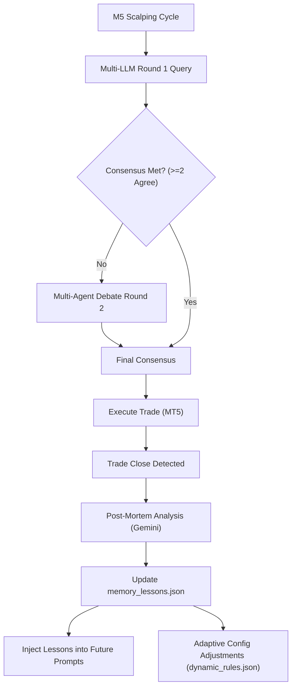

# Multi-LLM Consensus Trading Bot (MT5 + Python)

Boilerplate bot trading berbasis AI yang mengintegrasikan data pasar dari **MetaTrader 5 (MT5)** dengan tiga model bahasa besar (LLM) terkemuka: **OpenAI**, **Google Gemini**, dan **DeepSeek** via API.

Dirancang khusus untuk strategi **scalping M5 (5 menit)** pada Forex & Gold (`XAUUSD`). Bot ini memanggil ketiga AI secara paralel, melakukan voting/konsensus (minimal 2 dari 3 AI harus sepakat), lalu mengeksekusi order secara otomatis ke terminal MT5 Anda.

---

## 🏗️ Arsitektur Sistem Canggih (Branch `dev`)



### 🧠 Fitur AI Unggulan
1. **Multi-Agent Debate Protocol (Ronde 2)**: Jika voting di Ronde 1 tidak mencapai konsensus (misal 1 BUY, 1 SELL, 1 HOLD), bot secara otomatis memicu diskusi Ronde 2 tempat ketiga model saling mengkritik argumen satu sama lain sebelum mengambil keputusan final.
2. **Post-Mortem Trade Evaluator & In-Context Memory**: Setiap kali trade selesai (win/loss), Gemini mengevaluasi hasilnya dan mencatat 1 aturan ringkas ke `memory_lessons.json`. Pelajaran ini disuntikkan ke prompt analisis berikutnya agar AI terus belajar (*In-Context Learning*).
3. **Adaptive Dynamic Config**: Menghitung *win-rate* secara otomatis dari transaksi terakhir. Jika *win-rate* turun (<40%), bot memperketat konsensus menjadi 3/3 dan mengurangi SL multiplier. Jika *win-rate* tinggi (>70%), bot kembali ke mode optimal (2/3 konsensus).
4. **Google Search Grounding Fundamental Analysis**: Gemini secara berkala menjelajahi berita ekonomi real-time di Google Search untuk menentukan sentimen makro setiap pergantian sesi trading.
5. **Automatic Model Fallback & Timeout**: Jika model utama mengalami masalah / timeout (default 24s), bot secara otomatis beralih ke model cadangan (fallback model) tanpa membuat sistem terhenti.

---

## 📂 Struktur Proyek Modular (`src/`)

```text
c:\Vibe\tradingpartner\
├── main.py                  # Entry point utama loop trading
├── config.py                # Konfigurasi parameter, API keys, dan direktori
├── .env / .env.example      # File environmental variables
├── README.md                # Dokumentasi proyek
├── requirements.txt         # Daftar dependency library Python
│
├── src/                     # Paket Modul Utama
│   ├── core/                # Mesin Utama & Konektivitas
│   │   ├── mt5_connector.py # Konektor API MetaTrader 5
│   │   ├── llm_client.py    # Client API OpenAI, Gemini, DeepSeek (Paralel & Debate)
│   │   ├── consensus.py     # Mesin Voting Konsensus Multi-LLM
│   │   ├── risk_engine.py   # Master Risk Gate, Circuit Breaker & Limits
│   │   └── telegram_alerts.py # Modul Notifikasi Telegram Bot
│   │
│   └── analytics/           # Fitur Analitis & AI Lanjutan
│       ├── forecast_engine.py   # Proyeksi Harga Multi-Horizon (T+15m, T+60m)
│       ├── trade_evaluator.py   # Post-Mortem Evaluator & Lessons Memory
│       ├── macro_analyst.py     # MTF (M30, H1) & Fundamental Search Grounding
│       ├── dynamic_config.py    # Penyesuai Parameter Risiko Dinamis (Self-Tuning)
│       └── position_manager.py  # Pengelola Trailing Stop & Break-Even
│
├── data/                    # Cache JSON & State Lokal
│   ├── analysis_cache.json  # Cache analisis struktur MTF & Fundamental
│   ├── forecast_cache.json  # Cache proyeksi harga Multi-Horizon
│   ├── memory_lessons.json  # Memori pembelajaran hasil Post-Mortem
│   ├── dynamic_rules.json   # Parameter aturan dinamis
│   └── risk_state.json      # Rekam jejak state risiko & tiket historis
│
├── docs/                    # Dokumentasi & Tinjauan Kode
│   ├── command_code_review.md
│   ├── gpt-mini-code_review.md
│   ├── opus_review.md
│   └── vps_deployment.md
│
└── tests/                   # Script Pengujian API & Modul
    ├── test_apis.py         # Penguji keaktifan API Key
    └── test_macro.py        # Penguji modul MacroAnalyst
```


---

## 🛠️ Langkah-Langkah Instalasi & Penggunaan

### 1. Prasyarat (Prerequisites)
* **Sistem Operasi**: Windows (wajib karena library `MetaTrader5` hanya berjalan di Windows).
* **Python**: Versi 3.8 - 3.11 disarankan.
* **Aplikasi MT5**: Unduh dan instal terminal MetaTrader 5 dari broker Anda (misal: VT Markets) dan login ke akun demo Anda.

### 2. Instalasi Library Python
Buka terminal/PowerShell di direktori proyek ini, lalu jalankan:
```bash
pip install -r requirements.txt
```

### 3. Konfigurasi API Key & Akun
1. Salin file `.env.example` menjadi `.env`:
   ```bash
   copy .env.example .env
   ```
2. Buka file `.env` dan masukkan API Key Anda untuk:
   * `OPENAI_API_KEY`
   * `GEMINI_API_KEY`
   * `DEEPSEEK_API_KEY`
3. (Opsional) Jika ingin bot otomatis login ke akun MT5 Anda, isi data `MT5_LOGIN`, `MT5_PASSWORD`, dan `MT5_SERVER`. Jika dikosongkan, bot akan otomatis menyambung ke terminal MT5 yang saat itu sedang aktif di PC Anda.

### 4. Uji Coba API Key
Jalankan script test untuk memastikan semua kunci API Anda aktif:
```bash
python test_apis.py
```

### 5. Menjalankan Bot
Pastikan aplikasi MT5 Anda dalam keadaan terbuka dan terhubung ke internet, lalu jalankan:
```bash
python main.py
```

---

## ⚡ Mengaktifkan Live Execution
Jika Anda sudah yakin dengan hasil sinyal AI dan ingin bot langsung mengeksekusi order otomatis ke MT5:
1. Buka `config.py`.
2. Ubah baris berikut:
   ```python
   DRY_RUN = False
   ```
3. Jalankan kembali bot (`python main.py`). *Sangat disarankan mencoba di **Akun Demo** terlebih dahulu!*

---

## ⚠️ Disclaimer
Trading instrumen keuangan seperti Forex dan Gold memiliki tingkat risiko yang sangat tinggi. Bot ini disediakan sebagai kerangka kerja teknologi (boilerplate) dan contoh integrasi AI. Penggunaan bot untuk trading nyata sepenuhnya merupakan tanggung jawab pengguna. Selalu uji coba strategi Anda secara mendalam menggunakan akun demo sebelum mempertaruhkan modal nyata.
