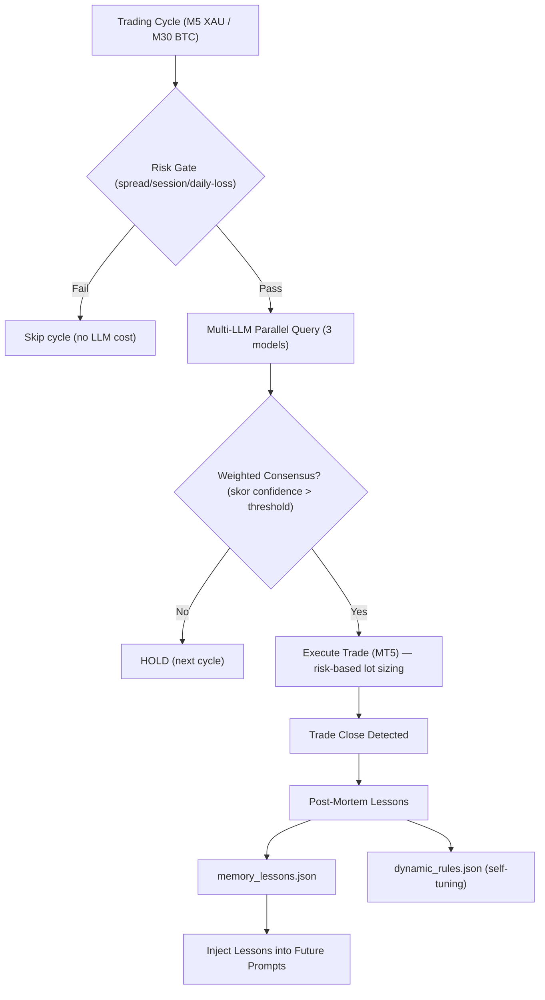

# Multi-LLM Consensus Trading Bot (MT5 + Python)

Bot trading berbasis AI yang mengintegrasikan data pasar dari **MetaTrader 5 (MT5)** dengan tiga model bahasa besar (LLM) via API: **OpenAI**, **Google Gemini**, dan **Claude (Anthropic)**.

- **Weekday**: `XAUUSD-ECNc` (Gold) — scalping **M5** — **Weekend**: `BTCUSD.c` (Bitcoin) — intraday **M30** (rotasi otomatis via `config.get_active_symbol`)
- Bot memanggil ketiga AI secara paralel, menghitung **weighted-confidence consensus**, lalu mengeksekusi order ke MT5.
- Akun: **LIVE** `VTMarkets-Live 3` (login `27556325`), magic number `20260625`.
- Semua timestamp internal pakai **WIB** (Asia/Jakarta).

---

## 🤖 Bot Binance Spot (Terpisah, `binance_bot/`)

Bot **kedua** untuk trading **Binance spot** (BTC/ETH/SOL) — berdiri sendiri di `binance_bot/`, tidak menyentuh bot MT5. Dibuat untuk **modal kecil** (tes ~$12 / Rp 200rb) dan **deploy Linux** (VPS, tanpa aplikasi tambahan — murni API).

**Perbedaan utama vs bot MT5:**
- **Arsitektur 2 proposer + 1 approver**: GPT + Gemini vote, **Claude approver** (hanya dipanggil saat 2/2 sepakat — hemat biaya).
- **Spot, tanpa margin/futures**: tidak bisa short (hanya BUY), nol risiko liquidation/hutang.
- **SL/TP via OCO order** di sisi exchange (spot tidak punya SL/TP broker).
- **REST API** (`/api/v3/*`) + HMAC API key — cukup untuk bot M30. Perhatikan changelog Binance: `/api/v1/*` sudah retire, pakai `/api/v3/*`.
- **Risk 1.5%** per trade dari equity USDT, daily loss limit ketat ($3 untuk modal $12), trading 24/7.

**Cara pakai:**
```bash
cd binance_bot
cp .env.example .env        # isi BINANCE_API_KEY, BINANCE_SECRET, LLM keys
python main.py              # TESTNET=True + DRY_RUN=True default (aman)
```
- **Testnet dulu** (`TESTNET=True`) → validasi order flow tanpa uang asli.
- **Dry-run** (`DRY_RUN=True`) → sinyal dihitung, order tidak dikirim.
- **Live** (`TESTNET=False`, `DRY_RUN=False`) → order beneran. Jangan ubah tanpa diskusi.
- Deploy Linux: `pip install -r binance_bot/requirements.txt` + systemd service (`Restart=always`).

**Status:** fase 1 (connector + risk + consensus + main loop + testnet test). Fase 2: Telegram alert, dashboard, post-mortem lessons.

---

## 🏗️ Arsitektur Sistem (Branch `dev`)



### 🧠 Fitur AI Aktif
1. **Weighted-Confidence Consensus (per-symbol)**: Tiga model (OpenAI, Gemini, Claude) dipanggil paralel tiap candle. Skor arah (BUY/SELL) = Σ confidence model yang vote arah itu. Sinyal menang kalau **≥ 2 model searah** DAN skor > threshold per-symbol (`confidence_threshold_for()`: **XAU 1.0**, **BTC 1.2**; saat defensif 3/3 = ×1.5). Model @51% tidak lagi setara @90%.
2. **Post-Mortem Trade Evaluator & In-Context Memory (per-symbol + theme-tagged)**: Tiap trade tertutup dievaluasi → 1 aturan ringkas masuk `memory_lessons.json` dengan tag tema (`entry`/`risk`/`timing`/`psychology`). Saat cap 15 tercapai, semua lessons di-summary jadi 1 blok via gpt-5.4-mini — dikelompokkan per-theme. Prompt berikutnya inject summary itu saja.
3. **Adaptive Dynamic Config (wired to consensus)**: Win-rate < 40% → konsensus diketat (3/3 defensif, threshold confidence ×1.5); win-rate > 70% → kembali normal 2/3. **Break-even trades excluded** dari win-rate.
4. **Recent Decision Memory (per-symbol)**: 6 keputusan terakhir per symbol. Inject ke prompt agar LLM sadar kalau sudah HOLD beruntun dan bisa self-correct.
5. **Calendar Programatik (DST-aware)**: Event ekonomi high-impact (NFP, CPI, PCE, GDP, FOMC, ECB, BOE, BOJ, SNB) dihitung lokal, WIB, DST-aware. Di-inject ke prompt hanya kalau event dalam **3 jam ke depan** (hemat token).
6. **Forecast Multi-Horizon per-symbol (background-pre-warmed)**: Proyeksi harga + invalidation level + optimal entry zone. **XAU: T+15m/T+60m** (cache 15 menit), **BTC: T+4h/T+D1** (cache 1 jam). Refresh di background thread (non-blocking). Bersifat **informational** — tidak memblokir eksekusi.
7. **3 M1 Candle Inject**: 3 candle M1 terakhir di-inject setelah candle utama untuk micro price action.
8. **AI Position Re-Evaluator (close via consensus)**: Tiap cycle, model diminta keputusan per posisi terbuka (`CLOSE`/`HOLD`). Kalau ≥ 2/3 sepakat CLOSE → bot eksekusi close dengan profit real (bukan 0.0), supaya daily P/L + loss streak akurat. **`signal` (entry baru) dan `position_actions` (posisi existing) dinilai independen** di prompt.
9. **Per-Symbol Daily Breakdown**: Agregat + breakdown per-symbol (`XAUUSD-ECNc` vs `BTCUSD.c`) — BEP dipisah eksplisit dari loss.
10. **Order Retry & Fill-Policy Fallback**: `send_trade_order` & `close_position` retry sampai 2× pada retcode PRICE_OFF/PRICE_CHANGED/REQUOTE/REJECT (deviation melebar), fallback ke fill mode yang didukung broker (`get_filling_policy`).
11. **Position Manager State Persistence + Multi-Symbol + Tick Freshness**: `_partial_closed_tickets` & `_break_even_tickets` di-persist ke `data/position_manager_state.json`. Manage semua posisi bot (XAU + BTC), skip symbol yang market-nya tutup (tick stale — XAU weekend).
12. **Risk-Based Lot Sizing**: Lot dihitung dari equity & SL — **BTC 1.5%**, **XAU 0.5%** per trade (`RISK_PERCENT_BTC/XAU`). Urutan: risk-based → recovery (×0.5) / session (×1.2) multiplier → clamp+round ke `volume_step`. Margin safety net (lot diturunkan kalau margin > 50% free). Fallback 0.01 kalau SL tidak diketahui.
13. **Automatic Model Fallback & Timeout**: Timeout 24s per call; primary path (post-mortem, MTF, lessons summary) urutan OpenAI → Gemini → Claude. Decision slot: OpenAI = gpt-5.4-mini, Gemini = gemini-3.1-flash-lite, **Claude = claude-sonnet-4-6**.

### 🚫 Fitur Non-Aktif (Disabled)
- **Fundamental Search Grounding**: OFF (`FUNDAMENTAL_ANALYSIS_ENABLED=False`). Search grounding Gemini sering kasih konteks basi ("ahead of NFP" berjam-jam setelah rilis).
- **Multi-Agent Debate Protocol**: OFF (`DEBATE_ENABLED=False`). 53 debate historis tidak pernah mengubah keputusan jadi trade — murni buang token.

---

## 📂 Struktur Proyek Modular (`src/`)

```text
tradingpartnerXAU/
├── main.py                  # Entry point utama loop trading
├── config.py                # Konfigurasi parameter, API keys, sesi, SL/TP, helper per-symbol
├── AGENTS.md                # Konteks proyek untuk sesi coding
├── .env / .env.example      # File environmental variables
├── README.md                # Dokumentasi proyek
├── requirements.txt         # Daftar dependency library Python
│
├── src/                     # Paket Modul Utama
│   ├── core/                # Mesin Utama & Konektivitas
│   │   ├── mt5_connector.py # Konektor API MetaTrader 5 (retry, fill policy, magic filter)
│   │   ├── llm_client.py    # Client API OpenAI, Gemini, Claude (Paralel, prompt dinamis)
│   │   ├── consensus.py     # Weighted-Confidence Consensus + SL/TP floor (ATR/spread)
│   │   ├── risk_engine.py   # Master Risk Gate, Circuit Breaker & Limits (BEP tolerance)
│   │   └── telegram_alerts.py # Modul Notifikasi Telegram Bot
│   │
│   └── analytics/           # Fitur Analitis & AI Lanjutan
│       ├── forecast_engine.py       # Proyeksi Harga Multi-Horizon (XAU T+15m/T+60m, BTC T+4h/T+D1)
│       ├── trade_evaluator.py       # Post-Mortem Evaluator & Lessons Memory (theme-tagged)
│       ├── macro_analyst.py         # MTF context per-symbol (XAU M30/H1, BTC H4/D1)
│       ├── dynamic_config.py        # Penyesuai Parameter Risiko Dinamis (Self-Tuning)
│       ├── economic_calendar.py     # Calendar event high-impact (DST-aware, programmatic)
│       ├── decision_memory.py       # Recent Decision Memory per-symbol
│       └── position_manager.py      # Trailing Stop, Break-Even, Partial Close (state persisted)
│
├── data/                    # Cache JSON & State Lokal (runtime, jangan di-commit)
│   ├── analysis_cache.json          # Cache analisis struktur MTF
│   ├── forecast_cache.json          # Cache proyeksi harga Multi-Horizon
│   ├── memory_lessons.json          # Memori pembelajaran hasil Post-Mortem
│   ├── dynamic_rules.json           # Parameter aturan dinamis
│   ├── risk_state.json              # Rekam jejak state risiko & tiket historis
│   ├── decision_memory.json         # 6 keputusan terakhir per-symbol
│   └── position_manager_state.json  # Ticket yg sudah partial-closed / break-even
│
├── docs/                    # Dokumentasi & Tinjauan Kode
│   ├── recap_session_2026-08-08.md  # Rekap kerjaan sesi (untuk review AI lain)
│   ├── command_code_review.md
│   ├── gpt-mini-code-review.md
│   ├── opus_review.md
│   └── vps_deployment.md
│
├── logs/                    # Log dumps (di-ignore dari git)
├── scratch/                 # Skrip analisis sementara — hapus setelah dipakai
│
└── tests/                   # Script Pengujian API & Modul
    ├── test_apis.py             # Penguji keaktifan API Key
    ├── test_macro.py            # Penguji modul MacroAnalyst
    ├── test_symbol_rotation.py  # Penguji rotasi simbol weekday/weekend + helper
    └── test_telegram.py         # Penguji notifikasi Telegram
```

---

## 🛠️ Langkah-Langkah Instalasi & Penggunaan

### 1. Prasyarat (Prerequisites)
* **Sistem Operasi**: Windows (wajib karena library `MetaTrader5` hanya berjalan di Windows).
* **Python**: Versi 3.8 - 3.11 disarankan.
* **Aplikasi MT5**: Unduh dan instal terminal MetaTrader 5 dari broker Anda (misal: VT Markets) dan login ke akun.

### 2. Instalasi Library Python
Buka terminal/PowerShell di direktori proyek ini, lalu jalankan:
```bash
pip install -r requirements.txt
```

### 3. Konfigurasi API Key & Akun
1. Salin file `.env.example` menjadi `.env`:
   ```bash
   copy .env.example .env
   ```
2. Buka file `.env` dan masukkan API Key Anda untuk:
   * `OPENAI_API_KEY`
   * `GEMINI_API_KEY`
   * `ANTHROPIC_API_KEY`
3. (Opsional) Jika ingin bot otomatis login ke akun MT5 Anda, isi data `MT5_LOGIN`, `MT5_PASSWORD`, dan `MT5_SERVER`. Jika dikosongkan, bot akan otomatis menyambung ke terminal MT5 yang sedang aktif di PC Anda.

### 4. Uji Coba API Key & Modul
Jalankan script test untuk memastikan semua komponen aktif:
```bash
python tests/test_apis.py             # Cek API key OpenAI/Gemini/Claude
python tests/test_macro.py            # Cek modul MacroAnalyst
python tests/test_symbol_rotation.py  # Cek rotasi simbol weekday/weekend
python tests/test_telegram.py         # Cek notifikasi Telegram
```

### 5. Menjalankan Bot
Pastikan aplikasi MT5 Anda terbuka dan terhubung ke internet, lalu jalankan:
```bash
python main.py
```
- Log: `trading_bot.log` (auto-rotate 2MB, keep 5000 baris). **Log bisa campur sesi demo + live** — untuk profit akurat, query MT5 langsung (`scratch/` script, hapus setelah dipakai).

### 6. Dashboard Analisis (Opsional)
Menampilkan kualitas trade, kualitas sinyal LLM, dan statistik standar dari log. Dua mode:

**Mode static** (generate satu file HTML, buka di browser):
```bash
python dashboard.py          # generate dashboard.html
```

**Mode live** (server lokal, baca log fresh tiap request + auto-refresh 5 detik **tanpa reload halaman**):
```bash
python dashboard.py --serve --port 8765   # buka http://127.0.0.1:8765/
```

Dashboard read-only — tidak menyentuh bot/MT5. Opsi: `-o out.html` (output static lain), `--all-eras` (tampilkan semua era model, bukan hanya era aktif).

---

## ⚡ Mode Eksekusi

| Mode | Setting | Perilaku |
|---|---|---|
| **Dry-Run** | `config.DRY_RUN = True` | Sinyal AI dihitung, tapi TIDAK kirim order ke MT5. Aman untuk validasi. |
| **Live** | `config.DRY_RUN = False` | Order beneran dieksekusi ke MT5. Magic number `20260625` — bot hanya kelola posisi dengan magic ini. |

> ⚠️ Sangat disarankan mencoba di **Akun Demo** dulu sebelum live. Project ini saat ini berjalan di akun **LIVE** `VTMarkets-Live 3` (login `27556325`) — perubahan parameter live butuh diskusi dulu.

---

## 🛡️ Gate Eksekusi (Hard Gates)

Yang **sebenarnya** memblokir eksekusi, urut:
1. **Risk gate** (`risk.can_trade`): spread ≤ 50 pts (XAU) / 2400 pts (BTC), sesi London/NY WIB + bukan danger zone (kecuali crypto), max daily loss $50, max 3 consecutive loss, max 6 posisi (4 saat recovery).
2. **Weighted consensus** ≥ 2 model searah dengan skor confidence > threshold per-symbol (XAU 1.0 / BTC 1.2; defensif 3/3 = ×1.5).
3. **SL/TP floor**: SL ≥ max(2× spread, 1× ATR), TP ≥ 1.5× SL.
4. **Risk-based lot sizing**: lot dihitung dari equity & SL (BTC 1.5% / XAU 0.5%), clamp ke volume broker + margin safety net.
5. **Max open positions** tercapai → skip.

Yang **TIDAK** memblokir (hanya soft hint di prompt / print):
- Confidence minimum numerik tambahan di luar weighted score
- Entry zone numerik (`optimal_entry_min/max` di-load tapi tidak dipakai)
- R:R forecast (cuma di-print informational)

---

## ⚠️ Disclaimer
Trading instrumen keuangan seperti Forex, Gold, dan Crypto memiliki tingkat risiko yang sangat tinggi. Bot ini adalah alat bantu berbasis AI — bukan saran finansial. Penggunaan bot untuk trading nyata sepenuhnya merupakan tanggung jawab pengguna. Selalu uji coba strategi Anda secara mendalam menggunakan akun demo sebelum mempertaruhkan modal nyata.
