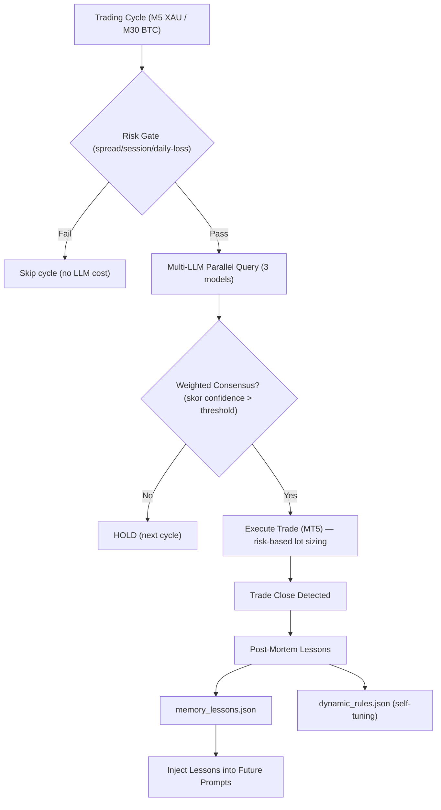

# Multi-LLM Consensus Trading Bot (MT5 + Python)

Bot trading berbasis AI yang mengintegrasikan data pasar dari **MetaTrader 5 (MT5)** dengan tiga slot model LLM via API: **OpenAI**, **Google Gemini**, dan **slot ketiga (default DeepSeek V4 Flash, bisa di-switch ke Claude)**.

- **Weekday**: `XAUUSD-ECNc` (Gold) — scalping **M5** — **Weekend**: `BTCUSD.c` (Bitcoin) — intraday **M30** (rotasi otomatis via `config.get_active_symbol`)
- **Multi-scan (opsional, mode `xau_pairs`)**: tiap candle M5 bot scan **SEMUA simbol dalam pool sekaligus** (bukan rotasi) — XAU + 2 pair FX cross non-USD, 1 LLM call per pair (3 call/candle)
- Bot memanggil AI sesuai **time-based mode** (single/dual/triple — lihat jadwal WIB), menghitung **weighted-confidence consensus**, lalu mengeksekusi order ke MT5.
- Akun: **LIVE** `VTMarkets-Live 3` (login `27556325`), magic number `20260625`.
- Semua timestamp internal pakai **WIB** (Asia/Jakarta).

## 🎯 Multi-Symbol Scan (Mode `xau_pairs`)

Default bot cuma trading **XAU** (`TRADING_MODE=xau`). Ada mode kedua: **XAU + Pairs** (`TRADING_MODE=xau_pairs`) — di mode ini tiap candle M5 bot **scan semua simbol sekaligus** (parallel scan, bukan round-robin), masing-masing 1× LLM call:

| # | Simbol (base) | Live / Demo | Timeframe | Spread (hasil scan) |
|---|---|---|---|---|
| 1 | `XAUUSD-ECN` | `XAUUSD-ECNc` / `XAUUSD-ECN` | M5 | ~10 pts (≈3% ATR) |
| 2 | `EURJPY-ECN` | `EURJPY-ECNc` / `EURJPY-ECN` | M5 | ~0-1 pts |
| 3 | `GBPCHF-ECN` | `GBPCHF-ECNc` / `GBPCHF-ECN` | M5 | ~0 pts |

**Kenapa pair-nya gitu?** Semua **cross non-USD** — korelasi rendah dengan XAUUSD (pair yang mengandung USD dibuang karena geraknya didominasi USD). Pool sengaja **3 simbol** (bukan 5): hemat biaya LLM per candle, dan `GBPCHF` (spread 0, tick value ~2× EURJPY) menggantikan pair EUR/JPY lainnya yang saling berkorelasi. Suffix `-ECN`/`-ECNc` di-auto-correct otomatis oleh `get_valid_trade_symbol` sesuai akun (live vs demo) — satu config jalan di dua-duanya.

**Cara kerja per candle (M5):**
1. Pool di-resolve via `config.get_rotation_pool()` → `[XAU] + FX_PAIR_SYMBOLS`, dipotong `MAX_ROTATION_SYMBOLS` (default 3)
2. Post-mortem trade tertutup dijalankan **1× aggregate** (bukan per-simbol)
3. Loop `for sym in pool:` → `config.SYMBOL = sym` → cycle penuh per-simbol: risk gate → data MT5 → macro/MTF per-simbol → 1× LLM call → weighted consensus → eksekusi
4. **Weekend**: XAU + FX market tutup Sabtu–Minggu → **bot istirahat (mode 24/5)**. Pool jatuh ke `[XAUUSD-ECN]` yang tutup (risk gate menolak semua, tidak ada LLM call). Opsional: set `ENABLE_BTC_ROTATION=True` → weekend ganti ke `[BTCUSD.c]` (24/7) — kode BTC sengaja dipertahankan, tinggal dinyalakan.

**Risk tetap aggregate**: max posisi (6) & daily loss ($50) dihitung **lintas semua simbol** (magic filter `20260625`), bukan per-simbol. Ganti mode: `.env` (`TRADING_MODE=...`), menu setup (item "Scan Mode"), atau dropdown dashboard (persist ke `.env`).

---

## 🤖 Bot Binance Spot (Branch `binance`)

Bot **kedua** untuk trading **Binance spot** (BTC/ETH/SOL) — **tidak ada di branch `dev`/`main`**. Kode-nya dipisah ke branch `binance` (arch: 2 proposer + 1 approver, OCO SL/TP, dry-run realistis, risk 1.5%, trading 24/7).

```bash
git checkout binance   # branch ini berisi binance_bot/ lengkap
```


---

## 🏗️ Arsitektur Sistem (Branch `dev`)



### 🧠 Fitur AI Aktif
1. **Weighted-Confidence Consensus (per-symbol)**: Tiga slot model (OpenAI, Gemini, slot-3: DeepSeek/Claude) dipanggil paralel tiap candle. Skor arah (BUY/SELL) = Σ confidence model yang vote arah itu. Sinyal menang kalau **≥ 2 model searah** DAN skor > threshold per-symbol (`confidence_threshold_for()`: **XAU 1.0**, **BTC 1.2**; saat defensif 3/3 = ×1.5). Model @51% tidak lagi setara @90%.
2. **Post-Mortem Trade Evaluator & In-Context Memory (per-symbol + theme-tagged)**: Tiap trade tertutup dievaluasi → 1 aturan ringkas masuk `memory_lessons.json` dengan tag tema (`entry`/`risk`/`timing`/`psychology`). Saat cap 15 tercapai, semua lessons di-summary jadi 1 blok via gpt-5.4-mini — dikelompokkan per-theme. Prompt berikutnya inject summary itu saja.
3. **Adaptive Dynamic Config (wired to consensus)**: Win-rate < 40% → konsensus diketat (3/3 defensif, threshold confidence ×1.5); win-rate > 65% → kembali normal 2/3. **Break-even trades excluded** dari win-rate.
4. **Recent Decision Memory (per-symbol)**: 6 keputusan terakhir per symbol. Inject ke prompt agar LLM sadar kalau sudah HOLD beruntun dan bisa self-correct.
5. **Calendar Programatik (DST-aware)**: Event ekonomi high-impact (NFP, CPI, PCE, GDP, FOMC, ECB, BOE, BOJ, SNB) dihitung lokal, WIB, DST-aware. Di-inject ke prompt hanya kalau event dalam **3 jam ke depan** (hemat token).
6. **Forecast Multi-Horizon per-symbol (background-pre-warmed)**: Proyeksi harga + invalidation level + optimal entry zone. **XAU: T+15m/T+60m** (cache 15 menit), **BTC: T+4h/T+D1** (cache 1 jam). Refresh di background thread (non-blocking). Bersifat **informational** — tidak memblokir eksekusi.
7. **3 M1 Candle Inject**: 3 candle M1 terakhir di-inject setelah candle utama untuk micro price action.
8. **AI Position Re-Evaluator (close via consensus)**: Tiap cycle, model diminta keputusan per posisi terbuka (`CLOSE`/`HOLD`). Kalau ≥ 2/3 sepakat CLOSE → bot eksekusi close dengan profit real (bukan 0.0), supaya daily P/L + loss streak akurat. **`signal` (entry baru) dan `position_actions` (posisi existing) dinilai independen** di prompt.
9. **Per-Symbol Daily Breakdown**: Agregat + breakdown per-symbol (`XAUUSD-ECNc` vs `BTCUSD.c`) — BEP dipisah eksplisit dari loss.
10. **Order Retry & Fill-Policy Fallback**: `send_trade_order` & `close_position` retry sampai 2× pada retcode PRICE_OFF/PRICE_CHANGED/REQUOTE/REJECT (deviation melebar), fallback ke fill mode yang didukung broker (`get_filling_policy`).
11. **Position Manager State Persistence + Multi-Symbol + Tick Freshness**: `_partial_closed_tickets` & `_break_even_tickets` di-persist ke `data/position_manager_state.json`. Manage semua posisi bot (XAU + BTC), skip symbol yang market-nya tutup (tick stale — XAU weekend).
12. **Risk-Based Lot Sizing**: Lot dihitung dari equity & SL — **BTC 1.5%**, **XAU 0.5%** per trade (`RISK_PERCENT_BTC/XAU`). Urutan: risk-based → recovery (×0.5) / session (×1.2) multiplier → clamp+round ke `volume_step`. Margin safety net (lot diturunkan kalau margin > 50% free). Fallback 0.01 kalau SL tidak diketahui.
13. **Model Slot Configurable + Routing Otomatis**: Slot ke-3 default **DeepSeek V4 Flash** (`deepseek/deepseek-v4-flash` — jauh lebih murah dari Claude sonnet, cukup untuk decision & forecast JSON) dengan fallback `claude-haiku-4-5-20251001`. Routing otomatis di `query_claude()`: `deepseek/...` → DeepSeek API (OpenAI-compatible), `claude-...` → Anthropic. Ganti model via **menu setup** (item "Model Claude Slot") atau **CLI flag** `--claude-model`. Log label otomatis ("DeepSeek" vs "Claude").
14. **Deteksi Close Manual (magic=0)**: `get_closed_positions_today` menerima OUT deal dengan `magic=0` (manual close dari MT5 mobile — magic tidak diteruskan) **hanya jika posisinya dibuka bot** (ada IN magic bot). Posisi yang dibuka manual user tidak ikut kehitung. Window P/L pakai tengah malam WIB → next-midnight (loss hari kemarin tidak masuk "hari ini"). **Reason close di-label jelas** ("manual" untuk magic=0, "SL"/"TP"/"stop-out" dst. dari kode MT5) — bukan "unknown".
15. **Post-Mortem Langsung saat Close**: Post-mortem + lesson dipicu **saat itu juga** saat close di-detect (loop 5 detik, background thread) — bukan nunggu candle berikutnya. `evaluated_tickets` persist di `memory_lessons.json` mencegah re-evaluasi tiket lama saat restart.
16. **Trailing Stop ATR-Adaptif (work bener)**: Activation `min(1.0×ATR, cap)` (XAU 500 pts / BTC 40000 pts), distance `0.5×ATR`. SL di-trail dari **harga ekstrem** sejak entry (tracked per-ticket di state file) — pullback tidak bisa narik SL mundur. Partial close di-`skip` di lot 0.01 (50% dari 0.01 = 0, gabisa dipecah).
17. **Fibonacci Retracement di Prompt**: `prepare_prompt` menghitung Swing High/Low dari 50 candle terakhir + level Fib 38.2%/50.0%/61.8% → di-inject ke blok "CURRENT INDICATORS & FIBONACCI SUMMARY". Bot bisa membaca potensi SELL koreksi / pullback di tren bullish dengan target Fib — tidak lagi buta soal level retracement.
18. **Prompt Template "ANALYSIS FREEDOM" (branch `dev` — `docs/prompt_claude.md`)**: static block diganti jadi konstitusi yang memberi LLM kebebasan memilih interpretasi (trend/momentum/breakout/pullback/mean-reversion/reversal). Indikator = input untuk judgment, bukan trigger/block wajib. Output schema bertambah: `setup`, `edge`, `invalidation` (opsional — HOLD tetap valid). Yang non-negotiable hanya **RISK CONSTRAINTS** (SL ≥ 2× spread & ~SL_MULT× ATR, TP ≥ 2× SL = R:R 2:1, thesis + invalidation jelas). **Multiplier per AI mode (11 Agustus): single 1.25×/2.5×, dual 1.5×/3.0×, triple 1.75×/3.5×**.
19. **Anti-Anchoring: Outcome-Only Decision History (branch `dev`)**: keputusan lama tidak lagi di-inject sebagai narasi arah — diganti ringkasan win/loss saja ("3 trade taken, 2 hit SL, 3 HOLD"). Mencegah LLM ke-anchor ke bias bullish/bearish basi berjam-jam. Macro & forecast diberi label advisory/informational-only.
20. **Prompt LLM Bebas Emoji (branch `dev`)**: `_strip_emoji()` diterapkan ke prompt final — emoji dari sumber mana pun (macro/forecast/lessons/calendar) dihilangkan sebelum dikirim ke LLM. UI/CLI/log tetap boleh pakai emoji.

### 🚫 Fitur Non-Aktif (Disabled)
- **Fundamental Search Grounding**: OFF (`FUNDAMENTAL_ANALYSIS_ENABLED=False`). Search grounding Gemini sering kasih konteks basi ("ahead of NFP" berjam-jam setelah rilis).
- **Multi-Agent Debate Protocol**: dihapus total (11 Agustus 2026). 53 debate historis tidak pernah mengubah keputusan jadi trade — murni buang token. Kode debate (`prepare_debate_prompt`, `DEBATE_ENABLED`) sudah dibersihkan, diganti **Time-Based AI Mode** (lihat fitur #21).

### ⏱️ Time-Based AI Mode (11 Agustus 2026)
Jumlah model AI yang dipanggil per cycle mengikuti jam WIB — hemat token tanpa buang safety di jam aktif:
- **00:01–08:59 → single** (OpenAI saja)
- **09:00–13:00 → dual** (OpenAI + DeepSeek slot-3)
- **13:01–18:59 → single** (OpenAI saja)
- **19:30–21:30 → triple** (OpenAI + Gemini + DeepSeek — London-NY overlap aja)
- **23:01–00:00 → single** (fallback, di luar jadwal eksplisit)

Config: `AI_MODE_POLICY` (schedule|fixed), `AI_MODE_SCHEDULE`, `AI_FIXED_MODE`. Konsensus adaptif: single → 1 model + threshold ×0.6; dual → 2/2 searah; triple → normal (defensif ×1.5). Gemini cuma kepanggil di mode triple (hemat token).

---

## 📂 Struktur Proyek Modular (`src/`)

```text
tradingpartnerXAU/
├── main.py                  # Entry point utama loop trading
├── config.py                # Konfigurasi parameter, API keys, sesi, SL/TP, helper per-symbol
├── AGENTS.md                # Konteks proyek untuk sesi coding
├── .env / .env.example      # File environmental variables
├── README.md                # Dokumentasi proyek
├── requirements.txt         # Daftar dependency library Python
│
├── src/                     # Paket Modul Utama
│   ├── core/                # Mesin Utama & Konektivitas
│   │   ├── mt5_connector.py # Konektor API MetaTrader 5 (retry, fill policy, magic filter)
│   │   ├── llm_client.py    # Client API OpenAI, Gemini, DeepSeek/Claude (paralel, routing otomatis)
│   │   ├── consensus.py     # Weighted-Confidence Consensus + SL/TP floor (ATR/spread)
│   │   ├── risk_engine.py   # Master Risk Gate, Circuit Breaker & Limits (BEP tolerance)
│   │   └── telegram_alerts.py # Modul Notifikasi Telegram Bot
│   │
│   └── analytics/           # Fitur Analitis & AI Lanjutan
│       ├── forecast_engine.py       # Proyeksi Harga Multi-Horizon (XAU T+15m/T+60m, BTC T+4h/T+D1)
│       ├── trade_evaluator.py       # Post-Mortem Evaluator & Lessons Memory (theme-tagged)
│       ├── macro_analyst.py         # MTF context per-symbol (XAU M30/H1, BTC H4/D1)
│       ├── dynamic_config.py        # Penyesuai Parameter Risiko Dinamis (Self-Tuning)
│       ├── economic_calendar.py     # Calendar event high-impact (DST-aware, programmatic)
│       ├── decision_memory.py       # Recent Decision Memory per-symbol
│       └── position_manager.py      # Trailing Stop, Break-Even, Partial Close (state persisted)
│
├── data/                    # Cache JSON & State Lokal (runtime, jangan di-commit)
│   ├── analysis_cache.json          # Cache analisis struktur MTF
│   ├── forecast_cache.json          # Cache proyeksi harga Multi-Horizon
│   ├── memory_lessons.json          # Memori pembelajaran hasil Post-Mortem
│   ├── dynamic_rules.json           # Parameter aturan dinamis
│   ├── risk_state.json              # Rekam jejak state risiko & tiket historis
│   ├── decision_memory.json         # 6 keputusan terakhir per-symbol
│   └── position_manager_state.json  # Ticket yg sudah partial-closed / break-even
│
├── docs/                    # Dokumentasi & Tinjauan Kode
│   ├── recap_session_2026-08-08.md  # Rekap kerjaan sesi (untuk review AI lain)
│   ├── prompt_claude.md             # Template prompt "ANALYSIS FREEDOM" (hanya di branch dev)
│   ├── command_code_review.md
│   ├── gpt-mini-code-review.md
│   ├── opus_review.md
│   └── vps_deployment.md
│
├── logs/                    # Log dumps (di-ignore dari git)
├── scratch/                 # Skrip analisis sementara — hapus setelah dipakai
│
└── tests/                   # Script Pengujian API & Modul
    ├── test_apis.py             # Penguji keaktifan API Key
    ├── test_macro.py            # Penguji modul MacroAnalyst
    ├── test_symbol_rotation.py  # Penguji rotasi simbol weekday/weekend + helper
    └── test_telegram.py         # Penguji notifikasi Telegram
```

---

## 🛠️ Langkah-Langkah Instalasi & Penggunaan

### 1. Prasyarat (Prerequisites)
* **Sistem Operasi**: Windows (wajib karena library `MetaTrader5` hanya berjalan di Windows).
* **Python**: Versi 3.8 - 3.11 disarankan.
* **Aplikasi MT5**: Unduh dan instal terminal MetaTrader 5 dari broker Anda (misal: VT Markets) dan login ke akun.

### 2. Instalasi Library Python
Buka terminal/PowerShell di direktori proyek ini, lalu jalankan:
```bash
pip install -r requirements.txt
```

### 3. Konfigurasi API Key & Akun
1. Salin file `.env.example` menjadi `.env`:
   ```bash
   copy .env.example .env
   ```
2. Buka file `.env` dan masukkan API Key Anda untuk:
   * `OPENAI_API_KEY`
   * `GEMINI_API_KEY`
   * `ANTHROPIC_API_KEY` (dipakai kalau slot ke-3 di-switch ke Claude)
   * `DEEPSEEK_API_KEY` (dipakai untuk slot ke-3 default — DeepSeek V4 Flash)
3. (Opsional) Jika ingin bot otomatis login ke akun MT5 Anda, isi data `MT5_LOGIN`, `MT5_PASSWORD`, dan `MT5_SERVER`. Jika dikosongkan, bot akan otomatis menyambung ke terminal MT5 yang sedang aktif di PC Anda.

### 4. Uji Coba API Key & Modul
Jalankan script test untuk memastikan semua komponen aktif:
```bash
python tests/test_apis.py             # Cek API key OpenAI/Gemini/Claude
python tests/test_macro.py            # Cek modul MacroAnalyst
python tests/test_symbol_rotation.py  # Cek rotasi simbol weekday/weekend
python tests/test_telegram.py         # Cek notifikasi Telegram
```

### 5. Menjalankan Bot
Pastikan aplikasi MT5 Anda terbuka dan terhubung ke internet, lalu jalankan:
```bash
python main.py
```
- Saat start muncul **menu setup interaktif** — nomor 3 (`Scan Mode`) untuk ganti XAU Only / XAU + Pairs, preset `[v1]/[v2]/[v3]` untuk pakai preset cepat.
- Log: `trading_bot.log` (auto-rotate 2MB, keep 5000 baris). **Log bisa campur sesi demo + live** — untuk profit akurat, query MT5 langsung (`scratch/` script, hapus setelah dipakai).

> 📘 **Panduan lengkap semua setting** (env var, pair list, risk, SL/TP rules, contoh `.env`) ada di **`CONFIG_TUTORIAL.txt`** di folder root.

### 6. Dashboard Analisis (Opsional)
Menampilkan kualitas trade, kualitas sinyal LLM, dan statistik standar dari log. Dua mode:

**Mode static** (generate satu file HTML, buka di browser):
```bash
python dashboard.py          # generate dashboard.html
```

**Mode live** (server lokal, baca log fresh tiap request + auto-refresh 5 detik **tanpa reload halaman**):
```bash
python dashboard.py --serve --port 8765   # buka http://127.0.0.1:8765/
```

Dashboard read-only — tidak menyentuh bot/MT5. Opsi: `-o out.html` (output static lain), `--all-eras` (tampilkan semua era model, bukan hanya era aktif).

---

## ⚡ Mode Eksekusi

| Mode | Setting | Perilaku |
|---|---|---|
| **Dry-Run** | `config.DRY_RUN = True` | Sinyal AI dihitung, tapi TIDAK kirim order ke MT5. Aman untuk validasi. |
| **Live** | `config.DRY_RUN = False` | Order beneran dieksekusi ke MT5. Magic number `20260625` — bot hanya kelola posisi dengan magic ini. |

> ⚠️ Sangat disarankan mencoba di **Akun Demo** dulu sebelum live. Project ini saat ini berjalan di akun **LIVE** `VTMarkets-Live 3` (login `27556325`) — perubahan parameter live butuh diskusi dulu.

> ⚠️ **Branch split (11 Agustus)**: `main` = prompt lama (Fibonacci + counter-trend rules, commit `744ad0a`), `dev` = prompt baru (ANALYSIS FREEDOM + strip emoji, commit `06159f6`). Sengaja dipisah — jangan merge `dev` → `main` tanpa konfirmasi.

---

## 🛡️ Gate Eksekusi (Hard Gates)

Yang **sebenarnya** memblokir eksekusi, urut:
1. **Risk gate** (`risk.can_trade`): spread ≤ 50 pts (XAU) / 2400 pts (BTC), sesi London/NY WIB + bukan danger zone (kecuali crypto), max daily loss $50, max 5 consecutive loss, max 6 posisi (4 saat recovery).
2. **Weighted consensus** ≥ 2 model searah dengan skor confidence > threshold per-symbol (XAU 1.0 / BTC 1.2; defensif 3/3 = ×1.5).
3. **SL/TP floor**: SL ≥ max(2× spread, SL_MULT× ATR), TP ≥ max(2× spread, TP_MULT× ATR) (**R:R 2:1**). Multiplier dinamis per AI mode: single 1.25×/2.5×, dual 1.5×/3.0×, triple 1.75×/3.5×.
4. **Risk-based lot sizing**: lot dihitung dari equity & SL (BTC 1.5% / XAU 0.5%), clamp ke volume broker + margin safety net.
5. **Max open positions** tercapai → skip.

Yang **TIDAK** memblokir (hanya soft hint di prompt / print):
- Confidence minimum numerik tambahan di luar weighted score
- Entry zone numerik (`optimal_entry_min/max` di-load tapi tidak dipakai)
- R:R forecast (cuma di-print informational)

---

## ⚠️ Disclaimer
Trading instrumen keuangan seperti Forex, Gold, dan Crypto memiliki tingkat risiko yang sangat tinggi. Bot ini adalah alat bantu berbasis AI — bukan saran finansial. Penggunaan bot untuk trading nyata sepenuhnya merupakan tanggung jawab pengguna. Selalu uji coba strategi Anda secara mendalam menggunakan akun demo sebelum mempertaruhkan modal nyata.
