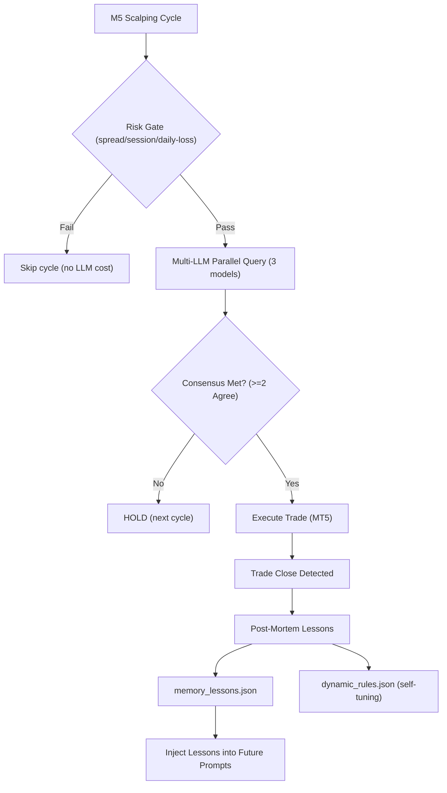

# Multi-LLM Consensus Trading Bot (MT5 + Python)

Bot trading scalping **M5** berbasis AI yang mengintegrasikan data pasar dari **MetaTrader 5 (MT5)** dengan tiga model bahasa besar (LLM) via API: **OpenAI**, **Google Gemini**, dan **DeepSeek**.

- **Weekday**: `XAUUSD-ECNc` (Gold) — **Weekend**: `BTCUSD.c` (rotasi otomatis via `config.get_active_symbol`)
- Bot memanggil ketiga AI secara paralel, melakukan voting/konsensus (default ≥ 2 dari 3 sepakat), lalu mengeksekusi order ke MT5.
- Akun: **LIVE** `VTMarkets-Live 3` (login `27556325`), magic number `20260625`.
- Semua timestamp internal pakai **WIB** (Asia/Jakarta).

---

## 🏗️ Arsitektur Sistem (Branch `dev`)



### 🧠 Fitur AI Aktif
1. **Multi-LLM Parallel Consensus (≥2/3, self-tuning)**: Tiga model (OpenAI, Gemini, DeepSeek) dipanggil paralel tiap M5 close. Voting memutuskan BUY/SELL/HOLD; SL/TP di-average dari vote yang setuju. Threshold dibaca dari `DynamicConfig` (lihat #3), fallback ke `config.CONSENSUS_THRESHOLD` jika dynamic rules tidak tersedia.
2. **Post-Mortem Trade Evaluator & In-Context Memory (per-symbol + theme-tagged)**: Tiap trade tertutup dievaluasi → 1 aturan ringkas masuk `memory_lessons.json` dengan tag tema (`entry`/`risk`/`timing`/`psychology`). Saat cap 15 tercapai, semua lessons di-summary jadi 1 blok via gpt-5.4-mini — dikelompokkan per-theme agar summary tidak bias ke satu topik. Prompt berikutnya inject summary itu saja (token ringan).
3. **Adaptive Dynamic Config (wired to consensus)**: Hitung *win-rate* otomatis dari trade tertutup. Win-rate < 40% → konsensus diketat ke 3/3 + SL multiplier turun; win-rate > 70% → kembali longgar ke 2/3. Nilai threshold live dipakai oleh `consensus.calculate_consensus()` (bukan cuma disimpan ke JSON).
4. **Recent Decision Memory (per-symbol)**: 6 keputusan terakhir per symbol disimpan ke `decision_memory.json`. Inject ke prompt agar LLM sadar kalau sudah HOLD beruntun dan bisa self-correct. Note tambahan muncul otomatis kalau ≥3 trailing HOLD.
5. **Calendar Programatik (DST-aware)**: Event ekonomi high-impact (NFP, CPI, PCE, GDP, FOMC, ECB, BOE, BOJ, SNB) dihitung lokal, WIB, DST-aware. Di-inject ke prompt hanya kalau event dalam **3 jam ke depan** (hemat token).
6. **Forecast Multi-Horizon (background-pre-warmed)**: Proyeksi T+15m/T+60m + invalidation level + optimal entry zone. Cache 15 menit, refresh di background thread (non-blocking) — caller tidak tunggu. Bersifat **informational** — tidak memblokir eksekusi.
7. **3 M1 Candle Inject**: 3 candle M1 terakhir (HH:MM O H L C V) di-inject setelah candle M5 untuk micro price action.
8. **AI Position Re-Evaluator (close via consensus)**: Tiap cycle, ketiga model diminta keputusan per posisi terbuka (`CLOSE`/`HOLD`). Kalau ≥2/3 sepakat CLOSE → bot eksekusi close dengan profit real (bukan 0.0), supaya daily P/L + loss streak akurat.
9. **Per-Symbol Daily Breakdown**: Agregat + breakdown per-symbol (`XAUUSD-ECNc` vs `BTCUSD.c`) supaya performa weekend BTC tidak menutupi weekday XAU.
10. **Order Retry & Fill-Policy Fallback**: `send_trade_order` & `close_position` retry sampai 2× pada retcode PRICE_OFF/PRICE_CHANGED/REQUOTE/REJECT (dengan deviation melebar), fallback ke `ORDER_FILLING_RETURN` jika IOC gagal.
11. **Position Manager State Persistence**: `_partial_closed_tickets` & `_break_even_tickets` di-persist ke `data/position_manager_state.json` supaya restart bot tidak double-trigger.
12. **Automatic Model Fallback & Timeout**: Timeout 24s per call; primary path (post-mortem, MTF, lessons summary) urutan OpenAI → Gemini → DeepSeek. Decision slot: OpenAI = gpt-5.4-mini (primary = fallback), Gemini = gemini-3.1-flash-lite, DeepSeek = deepseek-chat.

### 🚫 Fitur Non-Aktif (Disabled)
- **Fundamental Search Grounding**: OFF (`FUNDAMENTAL_ANALYSIS_ENABLED=False`). Search grounding Gemini sering kasih konteks basi ("ahead of NFP" berjam-jam setelah rilis). Penilaian murni dari data teknikal + knowledge LLM.
- **Multi-Agent Debate Protocol**: OFF (`DEBATE_ENABLED=False`). 53 debate historis tidak pernah mengubah keputusan jadi trade — murni buang token.

---

## 📂 Struktur Proyek Modular (`src/`)

```text
c:\Vibe\tradingpartner\
├── main.py                  # Entry point utama loop trading
├── config.py                # Konfigurasi parameter, API keys, sesi, SL/TP
├── AGENTS.md                # Konteks proyek untuk sesi coding
├── .env / .env.example      # File environmental variables
├── README.md                # Dokumentasi proyek
├── requirements.txt         # Daftar dependency library Python
│
├── src/                     # Paket Modul Utama
│   ├── core/                # Mesin Utama & Konektivitas
│   │   ├── mt5_connector.py # Konektor API MetaTrader 5
│   │   ├── llm_client.py    # Client API OpenAI, Gemini, DeepSeek (Paralel)
│   │   ├── consensus.py     # Mesin Voting Konsensus Multi-LLM
│   │   ├── risk_engine.py   # Master Risk Gate, Circuit Breaker & Limits
│   │   └── telegram_alerts.py # Modul Notifikasi Telegram Bot
│   │
│   └── analytics/           # Fitur Analitis & AI Lanjutan
│       ├── forecast_engine.py       # Proyeksi Harga Multi-Horizon (T+15m, T+60m)
│       ├── trade_evaluator.py       # Post-Mortem Evaluator & Lessons Memory (theme-tagged)
│       ├── macro_analyst.py         # MTF (M30, H1) context, cache per-symbol
│       ├── dynamic_config.py        # Penyesuai Parameter Risiko Dinamis (Self-Tuning)
│       ├── economic_calendar.py     # Calendar event high-impact (DST-aware, programmatic)
│       ├── decision_memory.py       # Recent Decision Memory per-symbol
│       └── position_manager.py      # Trailing Stop, Break-Even, Partial Close (state persisted)
│
├── data/                    # Cache JSON & State Lokal (runtime, jangan di-commit)
│   ├── analysis_cache.json          # Cache analisis struktur MTF
│   ├── forecast_cache.json          # Cache proyeksi harga Multi-Horizon
│   ├── memory_lessons.json          # Memori pembelajaran hasil Post-Mortem
│   ├── dynamic_rules.json           # Parameter aturan dinamis
│   ├── risk_state.json              # Rekam jejak state risiko & tiket historis
│   ├── decision_memory.json         # 6 keputusan terakhir per-symbol
│   └── position_manager_state.json  # Ticket yg sudah partial-closed / break-even
│
├── docs/                    # Dokumentasi & Tinjauan Kode
│   ├── command_code_review.md
│   ├── gpt-mini-code-review.md
│   ├── opus_review.md
│   └── vps_deployment.md
│
├── logs/                    # Log dumps (di-ignore dari git)
├── scratch/                 # Skrip analisis sementara — hapus setelah dipakai
│
└── tests/                   # Script Pengujian API & Modul
    ├── test_apis.py             # Penguji keaktifan API Key
    ├── test_macro.py            # Penguji modul MacroAnalyst
    ├── test_symbol_rotation.py  # Penguji rotasi simbol weekday/weekend
    └── test_telegram.py         # Penguji notifikasi Telegram
```


---

## 🛠️ Langkah-Langkah Instalasi & Penggunaan

### 1. Prasyarat (Prerequisites)
* **Sistem Operasi**: Windows (wajib karena library `MetaTrader5` hanya berjalan di Windows).
* **Python**: Versi 3.8 - 3.11 disarankan.
* **Aplikasi MT5**: Unduh dan instal terminal MetaTrader 5 dari broker Anda (misal: VT Markets) dan login ke akun.

### 2. Instalasi Library Python
Buka terminal/PowerShell di direktori proyek ini, lalu jalankan:
```bash
pip install -r requirements.txt
```

### 3. Konfigurasi API Key & Akun
1. Salin file `.env.example` menjadi `.env`:
   ```bash
   copy .env.example .env
   ```
2. Buka file `.env` dan masukkan API Key Anda untuk:
   * `OPENAI_API_KEY`
   * `GEMINI_API_KEY`
   * `DEEPSEEK_API_KEY`
3. (Opsional) Jika ingin bot otomatis login ke akun MT5 Anda, isi data `MT5_LOGIN`, `MT5_PASSWORD`, dan `MT5_SERVER`. Jika dikosongkan, bot akan otomatis menyambung ke terminal MT5 yang sedang aktif di PC Anda.

### 4. Uji Coba API Key & Modul
Jalankan script test untuk memastikan semua komponen aktif:
```bash
python tests/test_apis.py             # Cek API key OpenAI/Gemini/DeepSeek
python tests/test_macro.py            # Cek modul MacroAnalyst
python tests/test_symbol_rotation.py  # Cek rotasi simbol weekday/weekend
python tests/test_telegram.py         # Cek notifikasi Telegram
```

### 5. Menjalankan Bot
Pastikan aplikasi MT5 Anda terbuka dan terhubung ke internet, lalu jalankan:
```bash
python main.py
```
- Log: `trading_bot.log` (auto-rotate 2MB, keep 5000 baris). **Log bisa campur sesi demo + live** — untuk profit akurat, query MT5 langsung (`scratch/` script, hapus setelah dipakai).

---

## ⚡ Mode Eksekusi

| Mode | Setting | Perilaku |
|---|---|---|
| **Dry-Run** | `config.DRY_RUN = True` | Sinyal AI dihitung, tapi TIDAK kirim order ke MT5. Aman untuk validasi. |
| **Live** | `config.DRY_RUN = False` | Order beneran dieksekusi ke MT5. Magic number `20260625` — bot hanya kelola posisi dengan magic ini. |

> ⚠️ Sangat disarankan mencoba di **Akun Demo** dulu sebelum live. Project ini saat ini berjalan di akun **LIVE** `VTMarkets-Live 3` (login `27556325`) — perubahan parameter live butuh diskusi dulu.

---

## 🛡️ Gate Eksekusi (Hard Gates)

Yang **sebenarnya** memblokir eksekusi, urut:
1. **Risk gate** (`risk.can_trade`): spread ≤ 50 pts (XAU) / 2400 pts (BTC), sesi London/NY WIB + bukan danger zone (kecuali crypto), max daily loss $50, max 3 consecutive loss, max 6 posisi (4 saat recovery).
2. **Konsensus ≥ 2/3 model** setuju (dynamic: 3/3 kalau win-rate < 40%).
3. **Max open positions** tercapai → skip.

Yang **TIDAK** memblokir (hanya soft hint di prompt):
- Confidence minimum numerik (LLM bebas kasih berapa pun)
- Entry zone numerik (`optimal_entry_min/max` di-load tapi tidak dipakai)
- R:R forecast ≥ 1.2 (cuma di-print)

---

## ⚠️ Disclaimer
Trading instrumen keuangan seperti Forex, Gold, dan Crypto memiliki tingkat risiko yang sangat tinggi. Bot ini adalah alat bantu berbasis AI — bukan saran finansial. Penggunaan bot untuk trading nyata sepenuhnya merupakan tanggung jawab pengguna. Selalu uji coba strategi Anda secara mendalam menggunakan akun demo sebelum mempertaruhkan modal nyata.
