# Arsitektur 4-Layer Quant Funnel & Multi-LLM Consensus Jury

Berikut adalah diagram alir (*flowchart*) institusional lengkap yang memetakan seluruh siklus hidup data dan eksekusi order bot trading dari **Stage 1 Fast Quantitative Radar** (0 Token) hingga **Stage 2 Cognitive Multi-LLM Jury** dan **Stage 3 Real-Time Risk & Position Manager**.

---

```mermaid
flowchart TD
    %% Styling Nodes
    classDef dataFeed fill:#1e293b,stroke:#475569,stroke-width:2px,color:#f8fafc;
    classDef layer1 fill:#1e1b4b,stroke:#6366f1,stroke-width:2px,color:#f8fafc;
    classDef layer2 fill:#0f172a,stroke:#38bdf8,stroke-width:2px,color:#f8fafc;
    classDef layer3 fill:#064e3b,stroke:#10b981,stroke-width:2px,color:#f8fafc;
    classDef layer4 fill:#4c1d95,stroke:#a855f7,stroke-width:2px,color:#f8fafc;
    classDef layer5 fill:#7c2d12,stroke:#f97316,stroke-width:2px,color:#f8fafc;
    classDef decision fill:#3f3f46,stroke:#fbbf24,stroke-width:2px,color:#fbbf24;
    classDef reject fill:#450a0a,stroke:#ef4444,stroke-width:2px,color:#fca5a5;

    %% 0. DATA FEED LAYER
    subgraph S0 ["🌐 LAYER 0: NATIVE MT5 DATA INGESTION & BASKET REGIME"]
        MT5_DATA["📡 MT5 Sockets 6-Timeframe<br/>(MN1: 50b, W1: 100b, D1: 350b, H4: 400b, H1: 250b, M30: 200b)"]:::dataFeed
        CSM_FLOW["⚡ Boitoki CSM Engine<br/>(8-Basket Dual-Horizon Flow: H1 40% + M15 60%)"]:::dataFeed
        APEX_FE["🏛️ Apex FE Macro Engine<br/>(Central Bank Cycles + Economic Surprise + News Window)"]:::dataFeed
    end

    %% 1. LAYER 1: PURE QUANT MACRO STRATEGIC ENGINE (MSE)
    subgraph S1 ["🧭 LAYER 1: PURE QUANT MACRO STRATEGIC ENGINE (MSE 6-TF • 0 Token • <50ms)"]
        MSE_CALC["⚙️ 6-TF Native SBR/RBS Hierarchy & Symmetrical Stations<br/>• Dual-Grid Atlas DNA (50/100 pips)<br/>• Macro Range Pos & Dealing Range Bands<br/>• Dynamic Frontier Collision Engine"]:::layer1
        MSE_OUT{"🎯 Resolusi Mandat Tunggal<br/>(Single Source of Macro Truth)"}:::decision
        MSE_BUY["Mandat: HUNT_BUY_AT_RBS<br/>(Macro Bias Score ≥ +0.35) ➔ Direction: BULL"]:::layer1
        MSE_SELL["Mandat: HUNT_SELL_PULLBACK<br/>(Macro Bias Score ≤ -0.35) ➔ Direction: BEAR"]:::layer1
        MSE_NEUTRAL["Mandat: RANGE_BOUND<br/>(-0.35 < Score < +0.35) ➔ Direction: NEUTRAL"]:::layer1
    end

    MT5_DATA --> MSE_CALC
    CSM_FLOW --> MSE_CALC
    APEX_FE --> MSE_CALC
    MSE_CALC --> MSE_OUT
    MSE_OUT -->|Score ≥ +0.35| MSE_BUY
    MSE_OUT -->|Score ≤ -0.35| MSE_SELL
    MSE_OUT -->|Range Bound| MSE_NEUTRAL

    %% 2. LAYER 2: SYMMETRICAL 4D WAVE STATE & PHASE FSM
    subgraph S2 ["🔄 LAYER 2: SYMMETRICAL 4D WAVE STATE & PHASE FSM (H1 Retracement Anatomy)"]
        WAVE_EVAL["📊 Hitung Umur & Anatomi Gelombang:<br/>• Umur: bars_since_pivot (waktu sejak peak/trough)<br/>• Kecepatan: Velocity = ATR / bars_since_pivot<br/>• Karakter: Type A Waterfall vs Type B Compression Coil<br/>• Dealing Range Position (DR %)"]:::layer2
        FSM_STATE{"🚦 Filter Status Izin & Gating Matrix"}:::decision
        ST_LOCK["🔒 LOCK<br/>Waterfall / Vertical Spike Agresif (Velocity ≥ 0.30)"]:::reject
        ST_WAIT["⏳ WAIT<br/>Ekspansi di Ujung Ekstrim (DR ≥ 65% / ≤ 35%)"]:::reject
        ST_WATCH["👁️ WATCH<br/>Struktur Matang tapi Aliran CSM Bertentangan"]:::reject
        ST_ARMED["🎯 ARMED<br/>Kompresi Sehat (Type B Coil) di Reload Zone SBR/RBS"]:::layer2
        ST_GO["🟢 GO<br/>Displacement Reclaim / Valid Pin Bar Pantulan Terbit"]:::layer2
    end

    MSE_BUY --> WAVE_EVAL
    MSE_SELL --> WAVE_EVAL
    MSE_NEUTRAL --> WAVE_EVAL
    WAVE_EVAL --> FSM_STATE
    FSM_STATE --> ST_LOCK
    FSM_STATE --> ST_WAIT
    FSM_STATE --> ST_WATCH
    FSM_STATE --> ST_ARMED
    FSM_STATE --> ST_GO

    %% 3. LAYER 3: CONFLUENCE EXECUTION RADAR (M1, M2, M3)
    subgraph S3 ["⚡ LAYER 3: INTRADAY CONFLUENCE EXECUTION RADAR (60s Parallel Scanner)"]
        RADAR_GATE{"Mekanisme Mana yang Terpicu?"}:::decision
        M1_EXEC["🪤 M1: Universal Liquidity Sweep & SFP<br/>• Sapuan Asian H/L, PDH/PDL, EQH/EQL<br/>• Double Top/Bottom Swing Failure Pattern<br/>• Rejection Wick ≥ 35%<br/>• Target: Retest ke 50% Dealing Range"]:::layer3
        M2_EXEC["📈 M2: Trend-Aligned Pullback Retest<br/>• Pullback berdiskon ke EMA20 / 50% DR<br/>• Front-Run Limit Order di Bearish/Bullish FVG<br/>• SL di balik SBR/RBS + 0.35x ATR Buffer<br/>• Target: FRVP POC / Sub-Station seberang"]:::layer3
        M3_EXEC["🏰 M3: Multi-Touch Breakout & Delayed Retest<br/>• Level Cluster Support/Resistance disentuh ≥ 2x<br/>• Penembusan lilin momentum (Body ≥ 55%)<br/>• Delayed Limit Order saat Retest 3–4 bar<br/>• Target: Next Psychological Station"]:::layer3
    end

    ST_ARMED --> RADAR_GATE
    ST_GO --> RADAR_GATE
    RADAR_GATE -->|Liquidity Trap Reversal| M1_EXEC
    RADAR_GATE -->|Trend Pullback Reload| M2_EXEC
    RADAR_GATE -->|Cluster Breakout Continuation| M3_EXEC

    %% 4. LAYER 4: STAGE 2 — 3-LLM CONSENSUS JURY
    subgraph S4 ["🧠 LAYER 4: STAGE 2 — 3-LLM CONSENSUS JURY PROTOCOL (~5.5s Per Setup)"]
        DOSSIER["📑 Dossier Kompresi Tinggi:<br/>Top-Down Macro + 24 Lilin M5 + SMC Levels + FRVP POC + News"]:::layer4
        PASS1["⚡ PASS 1 (Paralel ~3.0s):<br/>• OpenAI o4-mini (Struktur Makro)<br/>• Gemini 3.1-Flash (Momentum & Sumbu)"]:::layer4
        PASS2["🔍 PASS 2 (Cross-Exam ~1.5s):<br/>• DeepSeek V4-Flash CRO (Devil's Advocate Audit)"]:::layer4
        HARD_VETO{"🛡️ Hard Risk Veto Gates:<br/>11 Bendera Risiko (Anti-Falling Knife, FOMO Chase, News Freeze)"}:::decision
        VETO_TRIPPED["❌ ORDER DIBATALKAN (VETO / HOLD)"]:::reject
        JURY_VOTE{"🗳️ Evaluasi Konsensus Bulat"}:::decision
        JURY_SPLIT["❌ Split Vote / Ada Model HOLD ➔ Batal (Zero Split Tolerance)"]:::reject
        JURY_PASS["✅ STRICT UNANIMOUS 3/3 (3 BUY atau 3 SELL)"]:::layer4
        SIZING_GATE{"Confidence Score ≥ 75%<br/>& Kapasitas MT5 ≥ 2 Slot?"}:::decision
        LOT_SINGLE["1 Tiket Standar @ 1.0x Base Lot<br/>(Target: TP1 & Trailing)"]:::layer4
        LOT_BOOST["🚀 2 Tiket Split @ 0.625x Base Lot (+25% Boost)<br/>• Pos #1: TP1 Partial 50% + BEP Lock<br/>• Pos #2: TP2 Extended Runner (FRVP POC / Corridor)"]:::layer4
    end

    M1_EXEC --> DOSSIER
    M2_EXEC --> DOSSIER
    M3_EXEC --> DOSSIER
    DOSSIER --> PASS1
    PASS1 --> PASS2
    PASS2 --> HARD_VETO
    HARD_VETO -->|Terdeteksi Risiko Berbahaya| VETO_TRIPPED
    HARD_VETO -->|Lolos Sensor Risiko| JURY_VOTE
    JURY_VOTE -->|Split Vote| JURY_SPLIT
    JURY_VOTE -->|Unanimous 3/3| JURY_PASS
    JURY_PASS --> SIZING_GATE
    SIZING_GATE -->|Tidak| LOT_SINGLE
    SIZING_GATE -->|Ya| LOT_BOOST

    %% 5. LAYER 5: STAGE 3 — RISK ENGINE & REAL-TIME POSITION MANAGER
    subgraph S5 ["🛡️ LAYER 5: STAGE 3 — REAL-TIME POSITION MANAGER (Loop 3 Detik di MT5)"]
        EXEC_MT5["📤 Kirim Pending Limit / Market Order ke MT5 Live<br/>(SL Ketat 15-20 pips | R:R ≥ 1.50 s/d 3.0:1)"]:::layer5
        POS_MONITOR["📡 Siklus Pengawalan Real-Time:"]:::layer5
        BEP_LOCK["1. Auto BEP + Pocket Profit (+15 pts) saat Profit 45-55% TP"]:::layer5
        PARTIAL_TP["2. Partial Close 50% di TP1 (Halte Pertama / EMA20 / H4 RBS)"]:::layer5
        TRAILING_2S["3. 2-Stage Dynamic Trailing Stop:<br/>• Stage 1 (Breathing 65-90% TP): 0.75x ATR H1 (Floor 80 pts)<br/>• Stage 2 (Terminal Lock ≥90% TP): 0.50x ATR M30 (Floor 30 pts)"]:::layer5
        STAGNATION["4. Peak-Aware Time-Decay Stagnation:<br/>Close jika stagnan ≥ 4 jam & Peak MFE < +0.30R"]:::layer5
        PRE_ROLLOVER["5. Pre-Rollover Shield (03:50 WIB):<br/>Tutup posisi dekat SL sebelum lonjakan spread rollover 04:00 WIB"]:::layer5
    end

    LOT_SINGLE --> EXEC_MT5
    LOT_BOOST --> EXEC_MT5
    EXEC_MT5 --> POS_MONITOR
    POS_MONITOR --> BEP_LOCK
    POS_MONITOR --> PARTIAL_TP
    POS_MONITOR --> TRAILING_2S
    POS_MONITOR --> STAGNATION
    POS_MONITOR --> PRE_ROLLOVER
```

