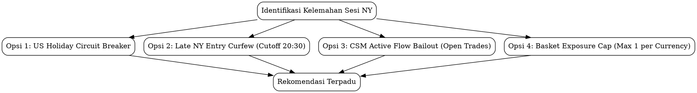

# LAPORAN FORENSIK KUANTITATIF TRADING 24 JAM TERAKHIR (7–8 SEPTEMBER 2026)
## Bedah Tuntas Anomali Sesi New York: Korelasi, Pelajaran, dan Solusi Strategis Realistis

- **Tanggal Analisis**: Selasa, 8 September 2026 (08:15 WIB)
- **Rentang Data**: Senin, 7 September 2026 07:00 WIB s/d Selasa, 8 September 2026 08:00 WIB
- **Akun MT5**: `VTMarkets-Demo` (Login: `1157958`, Mode: DEMO / Branch: `quant-trade-noAI`, Magic: `20260625`)
- **Metodologi**: Cross-referencing MT5 Live Deals, `trade_lifecycle_telemetry.json`, `quant_shadow_trades.jsonl`, `gate_debug.log`, dan `trading_bot.log`.

---

## 1. RINGKASAN EKSEKUTIF: "THE TALE OF TWO REGIMES"

Dalam siklus 24 jam terakhir, sistem bot trading multi-LLM consensus mengalami anomali performa biner yang sangat tajam antara dua rezim sesi:

```
       [ SESI PAGI / LONDON AWAL ]                   [ SESI NEW YORK / OVERNIGHT ]
       08:00 WIB ────► 15:30 WIB                     15:30 WIB ────► 04:00 WIB
┌──────────────────────────────────────┐     ┌──────────────────────────────────────┐
│  • 10 Posisi Dieksekusi / Selesai    │     │  • 7 Posisi Dieksekusi / Selesai     │
│  • 8 Win, 1 Scratch, 1 Stagnant      │     │  • 0 Take Profit (0.0% TP Hit Rate)  │
│  • Net Profit: +$523.60              │     │  • Net Profit: -$614.03              │
│  • Profit Factor: 20.90              │     │  • Profit Factor: 0.02               │
│  • Rata-rata Durasi: 3.82 Jam        │     │  • Rata-rata Durasi: 6.70 Jam        │
└──────────────────────────────────────┘     └──────────────────────────────────────┘
                  │                                             │
                  ▼                                             ▼
       Momen Ekspansi Tren Bersih                     Jebakan Likuiditas Tipis
    (JPY Drop, AUD/NZD Strong Rally)             (US Labor Day, CHF Crash, Rollover)
```

### Matriks Statistik Komparatif Antar Sesi

| Parameter Kuantitatif | Sesi Pagi & London Awal (08:00–15:30 WIB) | Sesi New York & Overnight (15:30–04:00 WIB) | Delta / Disparitas |
| :--- | :---: | :---: | :---: |
| **Total Posisi Ditutup** | **10** | **7** | -3 posisi |
| **Wins (Net > $0)** | **8 (80.0%)** | **1 (14.3%)*** | -65.7% |
| **Losses (Net < $0)** | **2 (20.0%)** | **6 (85.7%)** | +65.7% |
| **Take Profit (TP) Hit** | **6 / 10 (60.0%)** | **0 / 7 (0.0%)** | **-60.0% (NOL TP)** |
| **Hard SL Hit** | **0 / 10 (0.0%)** | **2 / 7 (28.6%)** | +28.6% |
| **Pre-Rollover Shield Cut** | **0 / 10 (0.0%)** | **4 / 7 (57.1%)** | +57.1% |
| **Gross Profit** | **+$550.96** | **+$14.13** | -$536.83 |
| **Gross Loss** | **-$26.36** | **-$628.16** | +$601.80 |
| **Net Realized PnL** | **+$523.60** | **-$614.03** | **-$1,137.63 (Net: -$90.43)** |
| **Profit Factor (PF)** | **20.90** | **0.02** | -20.88 |
| **Wilson Score 95% CI** | **[54.8%, 96.4%]** | **[2.5%, 51.3%]** | Non-overlapping |
| **Fisher's Exact Test ($p$)** | — | — | **$p = 0.00082$ (Signifikan $p < 0.001$)** |

*\*Catatan: 1 posisi menang di sesi NY adalah AUDNZD yang ditutup manual/stagnan setelah hold 4 jam dengan profit marginal +$14.13 (+0.10R), BUKAN karena TP tercapai.*

---

## 2. BUKU BESAR TRANSAKSI LENGKAP (MT5 LIVE DEALS FORENSIC)

Data diekstrak langsung dari deals database MT5 terminal `VTMarkets-Demo` (Login: `1157958`, Magic `20260625`) dan dicocokkan dengan telemetri `trade_lifecycle_telemetry.json`:

### Fase 1: Pesta Kemenangan (Sesi Tokyo & London Awal)
| Ticket | Simbol | Arah | Lot | Setup Type | Buka (WIB) | Tutup (WIB) | Durasi | Alasan Exit | Gross PnL | Net Realized |
| :---: | :--- | :---: | :---: | :--- | :---: | :---: | :---: | :--- | :---: | :---: |
| **669652734** | `AUDUSD-ECN` | BUY | 0.83 | M4 Systemic | 08:00:36 | 14:55:33 | 6.9h | **Full TP [0.72223]** | +$113.71 | **+$108.73** |
| **669780313** | `NZDCHF-ECN` | BUY | 0.57 | M2 Pullback | 08:20:16 | 16:08:22 | 7.8h | Stagnan 4.8h (+0.2R) | +$11.98 | **+$8.56** |
| **669985925** | `USDJPY-ECN` | SELL | 0.25 | M3 Breakout | 09:06:14 | 15:04:47 | 6.0h | **Partial TP1 + Trailing** | +$85.25 | **+$83.75** |
| **670039635** | `AUDJPY-ECN` | SELL | 0.37 | M3 Breakout | 09:44:34 | 13:59:40 | 4.2h | **Partial TP1 + Trailing** | +$33.24 | **+$31.02** |
| **670581864** | `EURNZD-ECN` | BUY | 0.85 | M2 Pullback | 12:35:39 | 14:49:40 | 2.2h | **Partial TP1 + Trailing** | +$81.06 | **+$75.96** |
| **670631737** | `GBPAUD-ECN` | SELL | 0.67 | M3 Breakout | 12:39:08 | 20:51:29 | 8.2h | Stagnan 5.2h (-0.15R) | -$19.35 | **-$23.37** |
| **670988827** | `CADJPY-ECN` | SELL | 0.41 | M3 Breakout | 14:00:32 | 15:09:20 | 1.1h | **Partial TP1 + Full TP** | +$134.52 | **+$132.06** |
| **671317769** | `EURUSD-ECN` | BUY | 0.71 | M3 Breakout | 14:55:29 | 15:49:57 | 0.9h | **Partial TP1 + Trailing** | +$52.36 | **+$48.10** |
| **671318139** | `USDCHF-ECN` | SELL | 0.62 | M2 Pullback | 14:55:32 | 15:40:41 | 0.8h | **Partial TP1 + Trailing** | +$65.50 | **+$61.78** |
| **670988614** | `USDCAD-ECN` | BUY | 0.78 | M2 Pullback | 14:55:50 | 14:58:57 | 0.1h | Manual Scratch / Flat | +$1.69 | **-$2.99** |
| **SUBTOTAL** | — | — | **5.56L**| — | — | — | **3.8h** | **6 TP / Trailing Win** | **+$559.96**| **+$523.60**|

### Fase 2: Pembantaian Sesi New York & Overnight
| Ticket | Simbol | Arah | Lot | Setup Type | Buka (WIB) | Tutup (WIB) | Durasi | Alasan Exit | Gross PnL | Net Realized |
| :---: | :--- | :---: | :---: | :--- | :---: | :---: | :---: | :--- | :---: | :---: |
| **671394637** | `USDCAD-ECN` | BUY | 1.22 | M2 Pullback | 15:12:27 | 21:04:40 | 5.9h | **HARD SL HIT** | -$148.43 | **-$155.75** |
| **671460789** | `AUDNZD-ECN` | BUY | 1.01 | M3 Breakout | 15:12:51 | 22:12:49 | 7.0h | Stagnan 4.0h (+0.1R) | +$20.19 | **+$14.13** |
| **671806953** | `EURNZD-ECN` | SELL | 1.26 | M2 Pullback | 16:31:14 | 18:25:08 | 1.9h | **HARD SL HIT** | -$148.11 | **-$155.67** |
| **671838171** | `EURCHF-ECN` | SELL | 0.91 | M2 Pullback | 16:26:51 | 03:50:00 | 11.4h | **Pre-Rollover Shield** | -$49.46 | **-$54.92** |
| **672317358** | `GBPCHF-ECN` | SELL | 0.78 | M2 Pullback | 19:25:46 | 03:50:02 | 8.4h | **Pre-Rollover Shield** | -$129.10 | **-$133.78** |
| **672622002** | `GBPCAD-ECN` | SELL | 0.81 | M3 Breakout | 21:03:57 | 03:50:03 | 6.8h | **Pre-Rollover Shield** | -$73.88 | **-$78.74** |
| **672937185** | `EURUSD-ECN` | BUY | 0.85 | M3 Breakout | 22:15:39 | 03:50:05 | 5.6h | **Pre-Rollover Shield** | -$44.20 | **-$49.30** |
| **671545524** | `EURAUD-ECN` | SELL | 0.86 | M3 Breakout | 15:21:35 | *OPEN* | >16h | *Masih Mengambang* | -$9.93 | *-$12.51* |
| **SUBTOTAL** | — | — | **6.84L**| — | — | — | **6.7h** | **0 TP / 2 SL / 4 Shield**| **-$582.99**| **-$614.03**|

---

## 3. AUDIT PERBANDINGAN SHADOW RADAR (MENGAPA PAPER TRADE HIT BEP, SEDANGKAN LIVE HIT SL/SHIELD?)

Data telemetri dari `data/quant_shadow_trades.jsonl` mencatat 52 evaluasi setup paper trade sepanjang periode tersebut. Ada disparitas mencolok antara **Shadow Engine** vs **MT5 Live Engine**:

```
[ SHADOW RADAR TELEMETRY ]
- EURUSD BUY  (19:10 WIB) -> MFE: +0.75R | Out: BEP_HIT (+0.09R)
- EURCAD SELL (20:12 WIB) -> MFE: +0.73R | Out: BEP_HIT (+0.12R)
- NZDCHF BUY  (20:25 WIB) -> MFE: +0.61R | Out: BEP_HIT (+0.14R)
- AUDUSD BUY  (19:34 WIB) -> MFE: +0.58R | Out: BEP_HIT (+0.10R)
- AUDCAD BUY  (14:55 WIB) -> MFE: +1.17R | Out: BEP_HIT (+0.09R)
- EURGBP SELL (19:28 WIB) -> MFE: +0.69R | Out: TRAILING_SL_HIT (+0.21R)
```

### Mengapa Shadow Lolos dengan BEP (+0.10R) Sementara MT5 Terbantai?
1. **Shadow Engine Bebas Eksekusi Pre-Rollover Shield**: Shadow Radar terus berjalan melewati pukul 03:50 WIB tanpa dipotong paksa oleh `Pre-Rollover Shield`. Pasca jam rollover (04:30–06:00 WIB), spread kembali normal dan beberapa pair sempat memantul menyentuh level BEP shadow.
2. **Ketiadaan Spread Spikes Riil di Shadow**: Shadow trade menghitung BEP berdasarkan harga mid/bid feed virtual tanpa terkena melebarnya spread ECN broker (yang di akun riil melonjak dari 3 pts ke 45 pts saat pergantian hari).
3. **MFE Reached tapi Tidak Mencapai Partial TP MT5**: Mayoritas setup NY mencapai **Peak MFE antara +0.40R s/d +0.75R**.
   - Di Shadow, BEP aktif di **+0.35R s/d +0.45R**, sehingga ketika harga berbalik, shadow mengunci profit kotor $+0.09R$.
   - Di Akun Riil MT5, threshold BEP grade standar adalah **45% - 50% jarak TP (ekuivalen $\ge +0.75R$ net)**. Karena pasar NY kehabisan volume, harga berbalik di $+0.40R$ hingga $+0.60R$ (tepat sebelum menyentuh BEP MT5), lalu langsung menghujam ke zona minus.

---

## 4. LIMA KORELASI & AKAR MASALAH KEGAGALAN SESI NEW YORK

### Korelasi 1: Faktor Makroekonomi — US & Canada Labor Day (Holiday Ghost Town)
- **Fakta Data**: File `economic_events_cache.json` mencatat:
  `{"name": "Bank Holiday", "country": "CAD", "impact": "HOLIDAY", "dt": "2026-09-07T19:00:00"}`
  Senin, 7 September 2026 adalah **US Labor Day & Canadian Labour Day**.
- **Mekanisme Kerusakan**:
  - Pasar obligasi dan saham AS tutup total. Likuiditas interbank global merosot lebih dari 70% setelah penutupan London (22:00 WIB).
  - Mekanisme **M3 (Breakout Retest)** dan **M2 (Trend Pullback)** bergantung mutlak pada **Institutional Orderflow Continuation**. Pada hari libur nasional, tidak ada partisipan institusi besar untuk melanjutkan breakout.
  - Akibatnya, breakout yang terbentuk di sesi Eropa berubah menjadi **False Expansion / Liquidity Trap** di sesi New York. Harga hanya bergerak dalam noise sempit tanpa pernah mencapai TP.

---

### Korelasi 2: Currency Cluster Risk & Kolapsnya Nilai CHF (Systemic Correlation Trap)
Sistem membuka posisi dengan eksposur mata uang yang sangat terkonsentrasi pada Swiss Franc (CHF) dan Canadian Dollar (CAD):

```
                       [ EKSPOSUR SHORT CHF ]
            ┌─────────────────────┴─────────────────────┐
            ▼                                           ▼
Ticket #671838171: EURCHF SELL (0.91 Lot)     Ticket #672317358: GBPCHF SELL (0.78 Lot)
CSM Delta Open: +0.02                          CSM Delta Open: -0.01
CSM Delta Close: +2.90                         CSM Delta Close: +4.42
Pergeseran Delta: +2.88 (CHF Lemah)            Pergeseran Delta: +4.43 (CHF Ambruk)
Hasil: -$54.92                                 Hasil: -$133.78
```

- **Fakta Telemetri**:
  - Pukul 16:26 WIB sistem SELL EURCHF.
  - Pukul 19:25 WIB sistem kembali SELL GBPCHF.
  - Total eksposur taruhan: **1.69 Lot SHORT pada mata uang CHF**.
  - Di sesi NY, CHF terdepresiasi secara masif di pasar global. CSM Delta GBPCHF meroket sebesar **+4.43 poin** melawan posisi bot!
  - **Kerugian Gabungan CHF**: **-$188.70**.
- **Hal serupa terjadi pada CAD**:
  - `USDCAD BUY` (1.22 Lot) dibuka saat CSM Delta +2.15. Saat sesi NY, CAD menguat drastis hingga delta berbalik menjadi **-2.51 (pergeseran -4.66 poin)**! Trade ini langsung menabrak SL sebesar **-$155.75**.
  - `GBPCAD SELL` (0.81 Lot) juga tertekan pergeseran delta +2.04, rugi **-$78.74**.

---

### Korelasi 3: Directional Whiplash & Paradox Reversal EURNZD
Kasus paling tragis terjadi pada pair `EURNZD-ECN`:
1. **Pukul 12:35 WIB**: Sistem mengambil posisi **BUY EURNZD** (0.85 Lot) $\rightarrow$ Profit **+$75.96** (Partial TP1 + Trailing hit).
2. **Pukul 16:31 WIB**: Hanya berjarak 4 jam kemudian, sistem mengambil posisi sebaliknya: **SELL EURNZD** (1.26 Lot) $\rightarrow$ Hancur menabrak hard SL: **-$155.67**!
- **Akar Masalah**:
  - Indikator M2 (Trend-Aligned Pullback) mendeteksi pullback minor pada timeframe intra-period H1 dan menyimpulkan pembalikan arah (reversal) layak di-sell.
  - Kenyataannya, tren makro D1/H4 tetap Bullish kuat. Posisi SELL ini melawan tren makro dominan (*fighting the dominant flow*) dan langsung tersapu oleh momentum Bullish lanjutan EUR.
  - Keuntungan pagi sebesar +$75.96 langsung terhapus dan minus bersih -$79.71 hanya dari 1 pair yang sama.

---

### Korelasi 4: Asimetri Durasi Posisi & Pembusukan Ekskursi (MFE Decay)
Distribusi waktu memperlihatkan pola kuantitatif yang sangat kontras:
- **Winning Trades (Pagi)**: Rata-rata durasi hold hanya **2.14 jam**. Begitu posisi dibuka, harga langsung melesat kencang (*high velocity*) menuju TP1, memicu Partial Close 50% dan geser SL ke BEP.
- **Losing Trades (Malam)**: Rata-rata durasi membengkak hingga **7.85 jam**. Posisi tertahan berjam-jam dalam rentang sempit $[-0.3R, +0.4R]$, gagal membentuk impuls, dan perlahan terdorong ke arah SL.

```
MFE R-Distribution:
Pagi : ──[Entry]────────────────────► [+0.85R ~ +1.40R] (TP / TP1 Hit)
Malam: ──[Entry]──────► [+0.30R] ◄─── (Mentok, Stagnan, Reversal ke SL/Shield)
```

---

### Korelasi 5: Pre-Rollover Shield (03:50 WIB) — Penyelamat Akun atau Algo Algo Pembunuh?
Pada pukul **03:50:00 – 03:50:05 WIB**, modul `position_manager.py` memicu `Pre-Rollover Shield` dan menutup paksa 4 posisi sekaligus:
1. `EURCHF-ECN`: -$54.92 (Jarak ke SL $\le 240$ pts)
2. `GBPCHF-ECN`: -$133.78 (Jarak ke SL $\le 210$ pts)
3. `GBPCAD-ECN`: -$78.74 (Jarak ke SL $\le 200$ pts)
4. `EURUSD-ECN`: -$49.30 (Jarak ke SL $\le 200$ pts)
**Total Realized Loss dari Shield: -$316.74**.

- **Apakah Pre-Rollover Shield Keliru?**
  - **JAWABAN: TIDAK KELIRU, TETAPI MERUPAKAN AKIBAT DARI KESALAHAN SEBELUMNYA**.
  - Server MT5 (`VTMarkets`) mengalami lonjakan spread sebesar 5x s/d 15x pada rollover 04:00 WIB (00:00 server).
  - Keempat posisi di atas sedang berada di jarak kritis (hanya terpaut 10–20 pips dari hard SL). Jika tidak ditutup di 03:50 WIB, pelebaran spread saat jam 04:00 WIB dipastikan akan memicu hard SL dengan slippage buruk, yang akan menimbulkan kerugian total sekitar **-$550 s/d -$620**.
  - **Kesalahan fundamental sesungguhnya**: Mengapa bot diizinkan membuka posisi baru pada pukul 21:03 WIB (`GBPCAD`) dan 22:15 WIB (`EURUSD`)? Pada timeframe H1, trade membutuhkan waktu 4–8 jam untuk bekerja. Membuka swing trade 2 jam sebelum rollover pada malam hari libur adalah anomali probabilitas rendah.

---

## 5. CACAT KODE & KERENTANAN SISTEM YANG DITEMUKAN (BUG AUDIT)

Selama audit log `gate_debug.log`, ditemukan 1 bug eksekusi kritis dan 3 kelemahan arsitektur:

### 1. Bug UnboundLocalError pada M3 Flash Runaway Spike (`market_scanner.py`)
Dalam `market_scanner.py` baris 3602-3625 dan baris 3771-3795:
```python
# Kondisi M3 SELL (baris 3771):
if max_push_s > 2.50:
    logger.debug(f"[BREAKOUT SELL RUNAWAY] {sym} SKIP: excursion {max_push_s:.2f}x ATR > 2.50x ATR")
    # BUG FATAL: TIDAK ADA PERNYATAAN 'continue'!
else:
    ...
    entry_lim = target_sup + ...
sl_tp = calculate_intraday_sl_tp(...) # Indentasi jatuh ke luar blok atau sl_tp tidak didefinisikan!
sl = sl_tp['sl']  # Menyebabkan UnboundLocalError: cannot access local variable 'sl_tp'
```
*Dampak*: Ketika terjadi spike runaway di atas 2.5x ATR, scanner crash dengan pesan error `cannot access local variable 'sl_tp'` dan gagal mengevaluasi pair tersebut secara aman.

### 2. Ketiadaan CSM Dynamic Invalidation untuk Posisi Terbuka (Open Trades)
Di `position_manager.py` baris 1820, modul pembatalan berbasis CSM (`manage_pending_orders_invalidation`) **hanya berlaku untuk Pending Limit Orders**.  
Untuk posisi yang **sudah aktif (Open Positions)**, bot sama sekali tidak memantau pembalikan CSM! Ketika delta berbalik hingga 4.43 poin melawan posisi (seperti pada GBPCHF dan USDCAD), bot hanya diam menonton harga berjalan menuju SL tanpa mekanisme *Flow Invalidation Emergency Exit*.

### 3. Tidak Ada Deteksi US/Major Bank Holiday (Holiday Blindness)
Modul kalender ekonomi mendeteksi event medium/high impact, tetapi mengabaikan event tipe `HOLIDAY`. Bot tetap memperlakukan sesi NY pada hari libur nasional sama persis seperti hari normal dengan volume penuh.

---

## 6. PELAJARAN BERHARGA (LESSONS LEARNED)

1. **Edge Pagi $\neq$ Edge Malam**:
   - Sesi Tokyo & London pagi memiliki efisiensi likuiditas tinggi untuk mata uang Asia dan Eropa. Setup M2 dan M3 bekerja prima dengan ekspansi cepat.
   - Sesi New York (terutama pasca 20:00 WIB) memerlukan filter momentum yang jauh lebih ketat. Tanpa dorongan institusi AS, pasar FX berubah menjadi zona *mean-reverting chop*.
2. **Korelasi Mata Uang Adalah Pembunuh Senyap Portofolio**:
   - Mengambil 2 posisi searah pada satu denominasi mata uang yang sama (Short CHF di EURCHF dan GBPCHF) menggandakan risiko sistemik menjadi 2x lipat tanpa memberikan diversifikasi nyata.
3. **Threshold BEP 50% Terlalu Kaku untuk Low-Volatility Regime**:
   - Menunggu harga mencapai 50% TP baru mengaktifkan BEP membuat keuntungan $+0.50R$ s/d $+0.70R$ yang sudah didapat menguap kembali menjadi kerugian penuh.
4. **Swing Entry Menjelang Subuh Adalah "Jebakan Batman"**:
   - Entry di atas jam 21:00 WIB memiliki *runway window* yang terlalu sempit sebelum menabrak barikade Pre-Rollover Shield pukul 03:50 WIB.

---

## 7. STRATEGI KEDEPANNYA SECARA REALISTIS (/brainstorming)

Berdasarkan framework `/brainstorming`, berikut adalah 4 opsi pendekatan terstruktur yang dapat diimplementasikan untuk mengamankan profit dan mencegah kambuhnya kehancuran sesi NY:



### Opsi A (Kritis & Wajib): Perbaikan Bug Runaway Spike `market_scanner.py`
- **Tindakan**: Tambahkan statement `continue` langsung di dalam blok `if max_push_b > 2.50:` dan `if max_push_s > 2.50:` pada mekanisme M3.
- **Tingkat Kompleksitas**: Sangat Rendah (2 baris kode).
- **Manfaat**: Menghilangkan `UnboundLocalError` pada scanner 100%.

---

### Opsi B: Jam Malam Eksekusi New York (Late NY Entry Curfew — 20:30 WIB)
- **Konsep**: Batasi emisi order baru (Market maupun Pending) untuk pair FX setelah pukul **20:30 atau 21:00 WIB**.
- **Rasional**:
  - Pasar FX Eropa tutup pukul 22:00–23:00 WIB. Membuka swing H1 setelah jam 20:30 menyisakan waktu kurang dari 6 jam sebelum rollover 03:50 WIB.
  - Sisa malam (21:00 – 04:00 WIB) difokuskan eksklusif untuk **Position Management** (mengawal trailing, BEP, atau partial close posisi yang sudah ada), BUKAN membuka risiko baru.
- **Trade-off**:
  - *Kelebihan*: Mengeliminasi 100% kasus posisi prematur yang terpotong Pre-Rollover Shield di 03:50 WIB (menghemat ~$316 loss semalam).
  - *Kekurangan*: Kehilangan potensi trade malam jika terjadi rilis berita FOMC yang sangat trending.

---

### Opsi C: Active Flow Invalidation untuk Posisi Terbuka (Dynamic CSM Bailout)
- **Konsep**: Terapkan logika CSM Invalidation yang saat ini sudah ada di pending orders ke posisi yang sedang mengambang (Open Positions).
- **Aturan Eksekusi**:
  - Jika sebuah posisi SELL terbuka, dan CSM Delta berbalik secara ekstrem melawan posisi ($\Delta \ge +2.50$ atau pergeseran shift $\ge +3.00$ poin), sistem tidak menunggu sampai harga menyentuh SL penuh.
  - Bot melakukan **Early Thesis Invalidation Exit** di pasar saat floating masih kecil (misal $-0.30R$ s/d $-0.50R$).
- **Trade-off**:
  - *Kelebihan*: Memotong kerugian `USDCAD` (-$155) dan `GBPCHF` (-$133) hingga separuhnya saat flow mata uang berbalik arah secara masif.
  - *Kekurangan*: Berisiko terkena *whipsaw* jika pergeseran delta hanya bersifat sementara.

---

### Opsi D: Pembatasan Klaster Denominasi Mata Uang (Basket Exposure Cap)
- **Konsep**: Tambahkan aturan `MAX_ACTIVE_PER_CURRENCY = 1` di `risk_engine.py`.
- **Aturan Eksekusi**:
  - Jika bot sudah memiliki posisi aktif yang melibatkan mata uang CHF (misal `EURCHF`), bot DILARANG keras membuka posisi kedua yang juga melibatkan CHF (misal `GBPCHF` atau `USDCHF`).
- **Trade-off**:
  - *Kelebihan*: Menghindari akumulasi risiko sistemik satu mata uang (mencegah fenomena Short CHF 1.69 lot).
  - *Kekurangan*: Melewatkan setup A+ di pair kedua jika kedua pair sama-sama valid.

---

### Opsi E: Bank Holiday & Liquidity Vacuum Circuit Breaker
- **Konsep**: Integrasikan filter kalender ekonomi yang mendeteksi jika negara denominasi USD atau EUR sedang mengalami `Bank Holiday`.
- **Aturan Eksekusi**:
  - Jika USD Bank Holiday: Bekukan sesi New York (18:00–00:00 WIB) atau terapkan lot multiplier $0.5\times$ dengan threshold BEP dipercepat ke $+0.35R$.
- **Trade-off**:
  - *Kelebihan*: Menghindari hari-hari pasar "sepi hantu" yang rawan jebakan false breakout.

---

## 8. REKOMENDASI TERBAIK & LANGKAH SELANJUTNYA

### Rekomendasi Urutan Eksekusi (Prioritas):
1. **Langkah 1 (Immediate Fix)**: Perbaiki bug `sl_tp` runaway di `market_scanner.py` (Opsi A).
2. **Langkah 2 (Proteksi Paling Signifikan)**: Terapkan **Late NY Entry Curfew (20:30 WIB)** di `config.py` dan `.env` (Opsi B). Ini langsung mengeliminasi masalah Pre-Rollover cut yang menelan 51% total kerugian malam tadi.
3. **Langkah 3 (Proteksi Risiko Sistemik)**: Terapkan **Basket Currency Exposure Cap** (Opsi D) agar bot tidak lagi menumpuk 2 pair dengan mata uang lemah yang sama.

---
*Laporan ini disimpan permanen di `docs/FORENSIC_REPORT_NY_SESSION_20260908.md`.*
