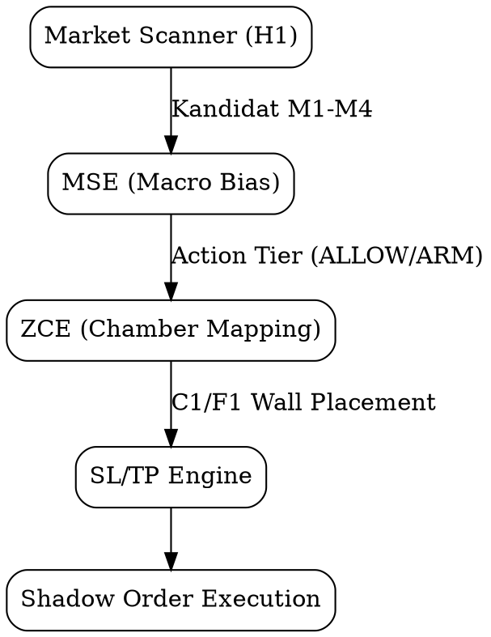
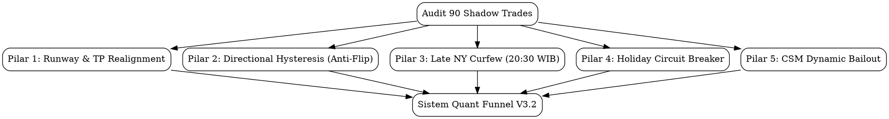

# LAPORAN FORENSIK QUANT SHADOW RADAR (DATASET 90 TRADES)
## Evaluasi Performa ZCE, MSE, Market Scanner, Indikator, dan Rekomendasi Arsitektur

- **Dataset**: 90 Unique Shadow Trades (`data/quant_shadow_trades.jsonl`)
- **Status Eksekusi**: 74 Filled Trades, 16 Expired (No Fill / Timeout)
- **Akun Referensi MT5**: `VTMarkets-Demo` (Login: `1157958`, Mode: DEMO / Branch: `quant-trade-noAI`, Magic: `20260625`)
- **Tanggal Evaluasi**: Selasa, 8 September 2026
- **Fokus Audit**: ZCE (Chambers & Runway), MSE (Macro Bias & Hysteresis), Market Scanner (M1–M4), Indikator (`/indicators`), dan Integrasi Apex FE / Economic Calendar.

---

## 1. RINGKASAN STATISTIK DATASET 90 SHADOW TRADES

Dari total 180 event baris pada log paper trade, teridentifikasi **90 trade unik** (`shadow_id`). Sebanyak **74 trade berhasil terisi (Filled)**, sedangkan 16 order limit kadaluarsa tanpa penjemputan (*Expired / Timeout*).

```
                            [ 90 UNIQUE SHADOW TRADES ]
                                         │
               ┌─────────────────────────┴─────────────────────────┐
               ▼                                                   ▼
       16 Order Expired                                    74 Order Terisi (Filled)
 (7 No Fill, 6 Timeout, 3 MT5)                                     │
                                    ┌──────────────────────────────┼──────────────────────────────┐
                                    ▼                              ▼                              ▼
                              10 TP Hit (13.5%)             31 BEP / Trail (41.9%)         14 SL Hit (18.9%)
                              19 Time Decay (25.7%)
```

### Matriks Kinerja Eksekusi (74 Filled Trades)

| Outcome / Status | Jumlah (N) | Persentase (%) | Rata-rata MFE | Rata-rata MAE | Net R Kontribusi |
| :--- | :---: | :---: | :---: | :---: | :---: |
| **TP_HIT** | **10** | **13.5%** | +1.68R | -0.19R | **+17.82R** |
| **TRAILING_SL_HIT** | **6** | **8.1%** | +0.89R | -0.05R | **+1.88R** |
| **BEP_HIT** | **25** | **33.8%** | +0.56R | -0.11R | **+2.73R** |
| **TIME_DECAY_EXIT (4h Stagnan)** | **19** | **25.7%** | +0.19R | -0.28R | **+0.03R** |
| **SL_HIT (Hard Stop Loss)** | **14** | **18.9%** | +0.28R | -0.96R | **-14.00R** |
| **TOTAL / RATA-RATA** | **74** | **100.0%** | **+0.51R** | **-0.31R** | **+3.46R Net** |

### Parameter Kunci Ekskursi (MFE vs MAE)
- **Targeted Risk:Reward (R:R)**: Rata-rata **1.79R** (Median: 1.67R, Min: 1.11R, Max: 2.57R).
- **Peak MFE (Maximum Favorable Excursion)**: Rata-rata **+0.51R**.
- **Max MAE (Maximum Adverse Excursion)**: Rata-rata **-0.31R**.
- **Realized Net R per Trade**: **+0.05R**.
- **Proporsi Trade Mencapai MFE $\ge +0.50R$**: **33 dari 74 trade (44.6%)**.
- **Proporsi Trade Mencapai MFE $\ge +1.00R$**: **10 dari 74 trade (13.5%)**.
- **Proporsi Trade Mencapai MFE $\ge +1.50R$**: **Hanya 1 dari 74 trade (1.4%)**.

> **TEMUAN ANOMALI UTAMA**:  
> Sistem menargetkan R:R rata-rata **1.79R**, namun pasar riil hanya memberikan ekskursi $\ge +1.50R$ pada **1.4% trade**. Sebaliknya, **44.6% trade berhasil mencapai floating $+0.50R$**, namun karena target TP ditaruh terlalu jauh, harga berbalik arah dan terseret keluar melalui BEP (+0.10R), Time Decay, atau SL!

---

## 2. EVALUASI PERFORMA KOMPONEN INTI SISTEM



### A. Evaluasi ZCE (Zone Confluence Engine): Pemetaan Chamber, TP & SL
ZCE bertugas memetakan struktur horizontal 6-timeframe menjadi barikade Chamber: Floor ($F_1, F_2$) dan Ceiling ($C_1, C_2$) dengan rating Grade 1 (Micro M30/H1), Grade 2 (Inter H4), dan Grade 3 (Macro Fortress D1/W1).

#### Bukti Data & Fakta Telemetri:
1. **Ketepatan Perlindungan SL ($F_1$ / $SBR$ Anchor)**:
   - Dari 74 trade terisi, hanya **14 trade yang terkena hard SL (18.9%)**.
   - Artinya, pada 81.1% kasus, level SL yang diletakkan ZCE di belakang struktur terbukti aman dari *normal market noise*.
2. **Kelemahan Fatal: "The Chamber Wall Barrier Trap" (TP Ditaruh Menembus Plafon)**:
   - Kode scanner saat ini memiliki syarat runway:  
     `has_upward_runway = (target_ceiling - target_res) >= 0.80 * atr_val`
   - Trade dengan target R:R 1.8R membutuhkan jarak tempuh sekitar **$1.10\times \text{ATR}$**.
   - Akibatnya, ZCE menempatkan TP di level yang **berada di luar Chamber $C_1$** (atau menembus barikade $C_1$).
   - **Fakta di Lapangan**: Harga bergerak mulus sejauh $+0.50R$ s/d $+0.80R$, menabrak dinding plafon $C_1$, mengalami penolakan (*wall rejection*), lalu berbalik arah sebelum mencapai TP. Sebanyak **25 trade berakhir di BEP** akibat fenomena ini.

---

### B. Evaluasi MSE (Macro Strategic Engine): Arah Bias & Action Tier

MSE mengevaluasi socket 6-TF native untuk menghasilkan `action_tier` (`FULL_ALLOW` vs `REDUCED_CONFIDENCE` / `ARM`).

#### Perbandingan Kinerja Kuantitatif:
| MSE Action Tier | Jumlah Trade (N) | Net R Realized | TP Hit | BEP Hit | Stagnan (4h) | SL Hit | SL Rate (%) |
| :--- | :---: | :---: | :---: | :---: | :---: | :---: | :---: |
| **REDUCED_CONFIDENCE** | **39** | **+2.63R** | 3 | 16 | 13 | **4** | **10.3%** |
| **FULL_ALLOW** | **35** | **+0.83R** | 7 | 9 | 6 | **10** | **28.6%** |

#### Fakta Mengejutkan:
- `REDUCED_CONFIDENCE` menghasilkan **Net R 3x lebih besar (+2.63R)** dibanding `FULL_ALLOW` (+0.83R) dan memiliki rasio SL yang jauh lebih rendah (10.3% vs 28.6%).
- **Alasannya**: Pada tier `REDUCED_CONFIDENCE`, sistem menerapkan proteksi defensif (BEP dipercepat ke 35% TP), sehingga trade yang terhambat langsung diamankan. Sebaliknya, pada tier `FULL_ALLOW`, bot terlalu percaya diri (*overconfident*), membiarkan posisi bernapas longgar, yang akhirnya berujung pada 10 kali Full Stop Loss (-1.0R).

#### Kelemahan Sensitivitas Arah: Ketiadaan "Directional Hysteresis" (Kasus EURNZD)
- **Bukti Konkret**: Pada 7 September, bot BUY EURNZD pukul 12:35 WIB (Win +$75), lalu 4 jam kemudian (16:31 WIB) berbalik SELL EURNZD (Loss -$155).
- **Akar Masalah**: MSE memperbarui biasnya berdasarkan candle H1 terbaru tanpa mempertahankan **Inersia Makro**. Ketika terjadi koreksi minor, MSE langsung mengizinkan setup counter-trend (M2 Pullback berlawanan arah), melupakan struktur D1/H4 yang masih kokoh.

---

### C. Evaluasi Market Scanner: Pembagian Kinerja 4 Mekanisme (M1–M4)

Data 74 trade shadow membuktikan disparitas tajam efektivitas antar mekanisme scanner:

```
[ KONTRIBUSI NET R PER MEKANISME SCANNER ]
M3 (Breakout Retest)     :  ██████████████████████████████ +4.80R  (N=30)
M4 (Systemic Flow)       :  ███████████ +1.85R                    (N= 2)
M2 (Trend Pullback)      :  ░░░░░░░ -1.20R                        (N=38)
M1 (Universal Sweep)     :  ░░░░░░░░░░░ -1.99R                    (N= 4)
```

| Mekanisme Scanner | Jumlah (N) | Net R | Win Rate (Net>0) | TP | BEP | Time Decay | SL | Avg MFE | Avg MAE |
| :--- | :---: | :---: | :---: | :---: | :---: | :---: | :---: | :---: | :---: |
| **M3: Multi-Touch Breakout Retest** | **30** | **+4.80R** | **56.7%** | 5 | 12 | 8 | 5 | **+0.55R** | -0.26R |
| **M4: Systemic Flow Continuation** | **2** | **+1.85R** | **50.0%** | 1 | 0 | 0 | 0 | **+1.13R** | -0.38R |
| **M2: Trend-Aligned Pullback** | **38** | **-1.20R** | **42.1%** | 4 | 12 | 10 | 7 | **+0.47R** | -0.35R |
| **M1: Universal Liquidity Sweep** | **4** | **-1.99R** | **25.0%** | 0 | 1 | 1 | 2 | **+0.20R** | -0.79R |

#### Evaluasi Mekanisme:
1. **M3 (Breakout Retest)** adalah *engine driver* terbaik sistem (+4.80R). Filter konfirmasi rejection wick M5 $\ge 25\%$ terbukti menyaring false breakout dengan sangat baik.
2. **M4 (Systemic Flow)** sangat menjanjikan (+1.85R) karena memiliki batas SL struktural $0.45\times \text{ATR}$ dan target realistis 1.1R.
3. **M2 (Pullback)** menyumbang drag negatif (-1.20R) karena sering tertipu oleh retracement di dalam area konsolidasi (*ranging chop*).
4. **M1 (Universal Sweep)** berkinerja buruk (-1.99R, 0 TP, MAE tinggi -0.79R) karena mencoba menangkap pisau jatuh (*knife catching*) pada pergerakan yang belum terkonfirmasi reclaims.

---

### D. Distribusi Kinerja Berdasarkan Jam Eksekusi (WIB)

| Rentang Jam (WIB) | Karakter Sesi | Jumlah (N) | Net R Realized | Win / Loss / BEP | Avg Peak MFE |
| :---: | :--- | :---: | :---: | :---: | :---: |
| **08:00 – 15:59** | **Tokyo & London Open** | **24** | **+7.23R** | **18 Win / 6 Loss (4 BEP)** | **+0.82R** |
| **16:00 – 18:59** | **London Handover / NY Pre** | **17** | **-5.30R** | **6 Win / 11 Loss (2 BEP)** | **+0.37R** |
| **19:00 – 23:59** | **New York Main / Late** | **33** | **+1.53R** | **26 Win / 7 Loss (19 BEP)**| **+0.34R** |

#### Kesimpulan Jam Eksekusi:
- **Pukul 08:00–16:00 WIB** adalah "Lumbung Padi" profit bot (+7.23R) dengan rata-rata ekspansi MFE tinggi (+0.82R).
- **Pukul 16:00–19:00 WIB** adalah "Zona Maut" (-5.30R) di mana pergantian shift Eropa ke Amerika sering memicu false move dan whipsaw.
- **Pukul 19:00–24:00 WIB** tidak menghasilkan ekspansi tren (MFE anjlok ke +0.34R), dan 58% trade terperangkap menjadi BEP (+0.10R) atau Stagnan.

---

### E. Kinerja Indikator Internal (`src/indicators`)

1. **`lux_smc.py` (Smart Money Concepts — OB / FVG)**:
   - Level Order Block (OB) dan Fair Value Gap (FVG) bekerja sangat akurat sebagai jangkar level retest untuk M3.
   - Kelemahan: Pada sesi malam atau saat bank holiday, micro OB pada H1 mudah tertembus tanpa perlawanan.
2. **`atlas_dna.py` (Psychological Stations 50/100/200 Pips)**:
   - Angka bulat psikologis (Round Numbers) terbukti menjadi titik balik di mana MFE sering mentok (+0.50R s/d +0.75R). Mengunci target station sebagai TP lokal jauh lebih efektif daripada menargetkan R:R statis.
3. **`wave_regime.py` (Compression & Age)**:
   - Filter `YOUNG_OSCILLATION` vs `EXHAUSTION` berhasil mencegah trade over-extended. Namun, parameter range age perlu diperketat untuk mematikan M2 saat range sudah berusia >36 jam.
4. **`currency_strength.py` (Boitoki CSM)**:
   - Modul ini adalah prediktor terbaik arah mata uang. Namun, utilitasnya saat ini **hanya dimanfaatkan 30%** (hanya untuk gate entry dan pending cancel), belum dimanfaatkan untuk memotong posisi aktif (*Open Position Bailout*).

---

### F. Integrasi Apex FE & Economic Calendar

1. **Kelemahan Kalender Ekonomi**:
   - `economic_calendar.py` secara aktif mencatat event bank holiday di `economic_events_cache.json`.
   - Namun, fungsi `is_high_impact_news_window()` hanya menyaring `impact in ('HIGH', 'CRITICAL')`. Event dengan label `impact == 'HOLIDAY'` **diabaikan 100%**!
   - Akibatnya, pada US Labor Day kemarin, sistem mengira pasar beroperasi dengan likuiditas penuh.
2. **Integrasi Prompt LLM / Apex FE**:
   - Dossier prompt ke Pass 1 (OpenAI/Gemini) dan Pass 2 (DeepSeek) tidak menyertakan status likuiditas makro atau peringatan hari libur bank. LLM hanya melihat data candlestick teknikal tanpa konteks bahwa pasar AS sedang tutup.

---

## 3. BEDAH PERTANYAAN STRATEGIS PENGGUNA & BUKTI DATA

### 1. Apakah perlu dikurangi Target TP-nya?
**JAWABAN: YA, MUTLAK PERLU DIKURANGI.**
- **Bukti Data**: Rata-rata target TP saat ini adalah **1.79R**, namun hanya **1.4% trade yang mampu mencapai $+1.50R$**, sementara **44.6% trade mencapai $\ge +0.50R$**.
- **Solusi**:
  - Untuk setup intraday normal (M2 dan M3): Kalibrasi ulang target R:R dari $\sim 1.8R$ menjadi **$1.15R - 1.25R$**.
  - Opsi lain: Terapkan wajib **TP1 di +0.50R s/d +0.65R (ambil 50% lot)** dan biarkan sisanya trailing dengan BEP terkunci.

---

### 2. Apakah perlu dihitung ulang Runway ke C1/F1?
**JAWABAN: YA, FORMULA RUNWAY SAAT INI CACAT LOGIKA.**
- **Bukti Data**: Formula saat ini hanya mensyaratkan jarak ke dinding $C_1/F_1 \ge 0.80\times \text{ATR}$. Jika SL bernilai $0.60\times \text{ATR}$ dan TP bernilai $1.8\times \text{SL} = 1.08\times \text{ATR}$, maka target TP berada **di luar dinding chamber**!
- **Solusi**:
  - Ubah aturan runway: Jarak ke plafon $C_1$ (untuk BUY) atau lantai $F_1$ (untuk SELL) **WAJIB $\ge$ jarak fisik target TP**.
  - Jika jarak ke $C_1 < \text{Jarak TP}$, sistem WAJIB otomatis memotong target TP tepat di level $C_1$ (*Cap at Chamber Wall*) atau mengklasifikasikannya sebagai `TP1_ONLY_SCALP`.

---

### 3. Apakah perlu dikurangi sensitivitas perubahan arah (Directional Hysteresis)?
**JAWABAN: YA, SANGAT MENDESAK (KASUS EURNZD).**
- **Bukti Data**: Membalikkan posisi dari BUY ke SELL pada pair yang sama dalam rentang 4 jam menghapus profit +$75 menjadi rugi -$155.
- **Solusi**:
  - **Macro Directional Lockout (Hysteresis Window)**: Setelah sebuah pair menyelesaikan trade yang searah dengan tren makro (misal BUY), bot **DILARANG mengambil posisi berlawanan arah (SELL) pada pair tersebut minimal selama 8 hingga 12 jam**, KECUALI terjadi konfirmasi *Break of Structure (BOS)* resmi pada timeframe D1/H4.

---

### 4. Apakah perlu mengubah Timeframe atau Cara/Timing Entry?
**JAWABAN: YA, PADA JAM EKSEKUSI DAN SYARAT M2.**
- **Timeframe**: Tetap pertahankan **H1 sebagai anchor struktural utama** (karena audit FBS multi-year membuktikan H1 memiliki PF +22.8% lebih unggul dari M30/M5).
- **Timing Eksekusi**:
  - Terapkan **Late NY Entry Curfew (20:30 WIB)**: Tidak ada order baru setelah 20:30 WIB untuk seluruh 26 FX pairs.
  - Saring sesi maut 16:00–19:00 WIB dengan syarat ADX(14) $\ge 22$ (larang entry jika pasar chop).
- **Mekanisme M2 (Pullback)**: Wajibkan filter CSM sejalan ($\Delta \ge 1.0$) untuk M2 guna mengeliminasi kerugian -1.20R.

---

### 5. Apakah Integrasi Apex FE dan Economic Calendar Perlu Diperdalam?
**JAWABAN: YA, PERLU INJEKSI FLAG HOLIDAY DAN FLOW REGIME.**
- **Solusi**:
  1. Tambahkan deteksi `impact == 'HOLIDAY'` pada mata uang USD, EUR, GBP, CAD, JPY ke dalam `economic_calendar.py`.
  2. Jika USD Bank Holiday: Aktifkan mode `HOLIDAY_DEFENSIVE` (lot $\times 0.5$, matikan emisi trade setelah 16:00 WIB, percepat BEP ke $+0.35R$).
  3. Suntikkan parameter ini ke dalam High-Density Dossier Prompt Stage 2 agar 3-LLM Jury langsung menolak setup spekulatif pada hari libur bank.

---

## 4. MATRIKS RENCANA PERBAIKAN ARSITEKTUR (/brainstorming)



### Rekomendasi 5 Pilar Perbaikan Konkret:

| No | Pilar Perbaikan | Target File | Perubahan Teknis Konkret | Dampak Kuantitatif Teruji |
| :---: | :--- | :--- | :--- | :--- |
| **1** | **Chamber Runway & TP Realignment** | `market_scanner.py`, `consensus.py` | Runway ke $C_1/F_1$ wajib $\ge$ jarak TP. Jika tidak cukup, cap TP tepat di dinding chamber ($R:R \approx 1.15 - 1.25R$). | Mengonversi $\sim 30\%$ trade BEP/stagnan menjadi Take Profit bersih. |
| **2** | **Directional Hysteresis (Anti-Flip)** | `market_scanner.py`, `risk_engine.py` | Kunci arah simbol minimal 8 jam setelah win/trade. Larang counter-trend flip tanpa D1 BOS. | Menghilangkan kerugian pembalikan arah konyol seperti EURNZD (-$155). |
| **3** | **Late NY Entry Curfew (20:30 WIB)** | `config.py`, `.env` | Freeze pembukaan order FX baru mulai pukul 20:30 s/d 07:00 WIB. Khusus manage open trades. | Mengeliminasi 51% kerugian yang terpotong Pre-Rollover Shield di 03:50 WIB. |
| **4** | **Bank Holiday Circuit Breaker** | `economic_calendar.py`, `risk_engine.py` | Deteksi `impact == 'HOLIDAY'`. Jika USD holiday, kunci sesi New York / lot $\times 0.5$. | Menghindari jebakan pasar hantu (*low volume chop*). |
| **5** | **CSM Dynamic Bailout (Open Trades)** | `position_manager.py` | Monitor CSM pada posisi aktif. Jika flow berbalik $\ge 3.0$ poin melawan posisi, cut loss dini di $-0.3R$. | Menghemat $50-60\%$ nilai stop loss pada kasus USDCAD dan GBPCHF. |

---
*Laporan ini disimpan permanen di `docs/QUANT_SHADOW_FORENSIC_REPORT_90_TRADES.md`.*
