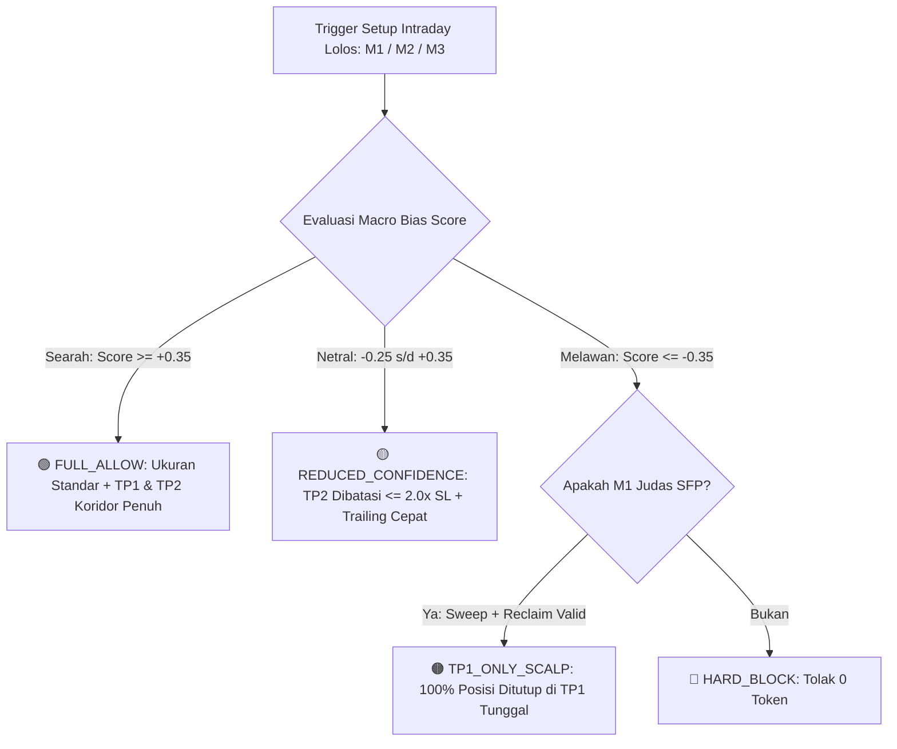

# MASTER TECHNICAL SPECIFICATION DOCUMENT
## 2-Stage Quant Funnel Multi-LLM Consensus Autonomous Trading System
### (Strict Unanimous 3/3, Pure Quant 6-TF MSE & Single Policy Path Architecture)

**Target Platform**: MetaTrader 5 (`VTMarkets-Live 3`, Account `27556325`, Raw ECN, Magic `20260625`)  
**Trading Universe**: 26 Simbol Terkurasi (20 FX Majors/Crosses, 6 NZD Alpha Crosses, BTCUSD Weekend Rotation)  
**Consensus Protocol**: Strict Unanimous 3/3 Rule (Wajib 3/3 Model Searah; 2/3 atau Split = HOLD Otomatis)  
**Symmetry Architecture**: Dual-Directional Equivalence (100% Simetris BUY & SELL Logic Gates, SBR/RBS, CSM Matrix)  
**AI Mode**: `AI_FIXED_MODE = "triple"` (OpenAI o4-mini + Gemini 3.1-Flash + DeepSeek V4-Flash CRO)  
**On-Demand Mode**: Dedicated OpenAI `o4-mini` + Pure Quant MSE 6-TF Socket Context  
**Zona Waktu**: Asia/Jakarta (WIB = GMT+7, MT5 Server GMT+3 + 4 Jam, Rollover 04:00 WIB)  
**Branch**: `quant-trade`

---

# 📚 Master Glossary & Standarisasi Istilah Proyek

Untuk mencegah kerancuan dan menjaga konsistensi di seluruh antarmuka (Terminal Bento HUD, Telegram Bot, Prompt LLM, dan Kode Sumber), berikut adalah glosarium istilah resmi tunggal:

| Istilah Resmi Tunggal | Istilah Lama / Variasi yang Dihapus | Definisi & Makna Teknis | Contoh Angka / Format |
|---|---|---|---|
| 📍 **`Reload Zone`** | `Delivery Anchor`, `Institutional Anchor`, `Entry Anchor` | Area lelang harga diskon/pullback di mana institusi mengisi ulang posisi (*reload*) sebelum ekspansi lanjutan. | `Reload Zone : $78,993.88` atau `0.93550 ➔ 0.93480` |
| 🛡️ **`Baseline Floor SL`** | `Intraday SL (Anti-Hunt)`, `Structural SL` | Level Stop Loss fisik berbasis struktur support/resistance terdekat + buffer anti-wick + safety floor ATR. | `SL $79,443.88 (SL $450 USD)` atau `160 pts` |
| 🎁 **`TP1 (Partial Close)`** | `Take Profit 1`, `Target Estafet 1` | Target profit stasiun pertama. Saat tersentuh: bot mencairkan 50% lot dan menggeser SL ke titik aman (Risk-Free BEP). | `TP1 $78,318.88 (+1.50R)` |
| 🏆 **`TP2 (Extended Runner)`** | `Target Estafet 2`, `Macro Target` | Target profit koridor makro lanjutan yang dikawal dengan 2-Stage Dynamic Trailing Stop. | `TP2 $77,259.58 (+3.85R)` |
| 🧱 **`SBR (Support-Become-Resistance)`** | `Resistance Zone`, `Ceiling Wall` | Bekas lantai support yang telah ditembus ke bawah dan kini beralih fungsi menjadi atap plafon lelang SELL. | `D1 SBR 1.35500` |
| 🏗️ **`RBS (Resistance-Become-Support)`** | `Support Zone`, `Floor Wall` | Bekas atap resistance yang telah ditembus ke atas dan kini beralih fungsi menjadi lantai lelang BUY. | `H4 RBS 1.34800` |
| 🧭 **`Sub-Floor` & `Sub-Ceiling`** | `Dynamic Stations`, `Psychological Grid` | Garis halte harga bulat psikologis (step 50/100 pips) dari Atlas DNA hasil riset 16.2 tahun MetaQuotes. | `Floor [1.34500] <-> Ceil [1.35000]` |
| 🌊 **`Wave State`** | `4D Market State`, `Wave Regime` | Klasifikasi anatomi pasar 4-Dimensi: `TYPE_A_WATERFALL_LOCK` (pisau jatuh), `TYPE_B_COMPRESSION_ARMED` (kompresi coil), atau `BASE_RECLAIM` (reclaim). | `TYPE_B_COMPRESSION_ARMED` |
| 🚦 **`Permission State`** | `Trade State Permission` | Izin eksekusi radar: `GO` (reclaim valid), `ARM` (siaga limit), `WAIT` (tunggu diskon/anti-FOMO), `LOCK` (dilarang trade). | `Permission : WAIT ⏳` |
| 🎛️ **`Action Tier`** | `Operational Tier Matrix` | 5-Tier matriks risiko makro: `FULL_ALLOW`, `REDUCED_CONFIDENCE`, `TP1_ONLY_SCALP`, `WATCH_ONLY`, `HARD_BLOCK`. | `Tier : FULL_ALLOW` |
| 🌐 **`Boitoki CSM`** | `Currency Strength Matrix` | Kekuatan relatif 8 mata uang global berbasis 7 USD Majors untuk mencegah jebakan manipulasi pair tunggal. | `CSM: USD > JPY > EUR` |

---

## Daftar Isi
1. [Bab 1: Executive Architecture & High-Level Design](#bab-1-executive-architecture--high-level-design)
2. [Bab 2: Fractal Multi-Timeframe Hierarchy & Symbol Universe](#bab-2-fractal-multi-timeframe-hierarchy--symbol-universe)
3. [Bab 3: Stage 1 Radar — Trio Mekanisme Presisi (M1, M2, M3)](#bab-3-stage-1-radar--trio-mekanisme-presisi-m1-m2-m3)
4. [Bab 4: 4-Dimensional Market State Engine (wave_state.py)](#bab-4-4-dimensional-market-state-engine-wave_statepy)
5. [Bab 5: Universal 8-Currency Basket Circuit Breaker (currency_strength.py)](#bab-5-universal-8-currency-basket-circuit-breaker-currency_strengthpy)
6. [Bab 6: Macro Strategic Engine (MSE) & Zonal SBR/RBS](#bab-6-macro-strategic-engine-mse--zonal-sbrrbs)
7. [Bab 7: LuxAlgo SMC, Liquidity Map & FRVP Confluence](#bab-7-luxalgo-smc-liquidity-map--frvp-confluence)
8. [Bab 8: Stage 2 Multi-LLM Consensus Jury & Strict 3/3 Protocol](#bab-8-stage-2-multi-llm-consensus-jury--strict-33-protocol)
9. [Bab 9: Single Policy Path SL/TP Floor & Ceiling Guardrails](#bab-9-single-policy-path-sltp-floor--ceiling-guardrails)
10. [Bab 10: Risk Engine & Account Capital Preservation (risk_engine.py)](#bab-10-risk-engine--account-capital-preservation-risk_enginepy)
11. [Bab 11: Real-Time Position Management Lifecycle (position_manager.py)](#bab-11-real-time-position-management-lifecycle-position_managerpy)
12. [Bab 12: Dedicated On-Demand OpenAI o4-mini & Telegram Controller](#bab-12-dedicated-on-demand-openai-o4-mini--telegram-controller)
13. [Bab 13: Apex Paragon Macro Fundamental Engine & Dual-Source News Layer](#bab-13-apex-paragon-macro-fundamental-engine--dual-source-news-layer)

---

## Bab 1: Executive Architecture & High-Level Design

Bot trading beroperasi dengan arsitektur **2-Stage Quant Funnel** yang memisahkan komputasi matematis berat di Python dari audit kognitif AI:

```
+-----------------------------------------------------------------------------------+
|               STAGE 1: FAST QUANTITATIVE RADAR (Lokal di MT5 • 60 Detik • 0 Token)|
|  Universe: 26 Simbol Paralel | Sockets: MN1, W1, D1, H4, H1, M30                  |
|  [M1: Judas Sweep SFP]  [M2: Pullback Retest]    [M3: HTF Weekly Wall Reversal]   |
|  [BUY: Diskon + RBS]    [SELL: Premium + SBR]    [CSM 8-Basket Dual-Horizon Flow] |
|  [Wave State FSM: ARM / GO / WAIT / LOCK]       [MSE 5-Tier Action Matrix]        |
+-----------------------------------------+-----------------------------------------+
                                          | (Hanya 8-15 Setup A+ / hari lolos)
                                          v
+-----------------------------------------------------------------------------------+
|               STAGE 2: 3-LLM CONSENSUS JURY (Kognitif Paralel & Audit • ~5.5s)    |
|  PASS 1 (~3.0s): OpenAI o4-mini (Struktur Makro) + Gemini 3.1-Flash (Momentum/Wick)|
|  PASS 2 (~1.5s): DeepSeek V4-Flash CRO (Devil's Advocate Audit + 24 Candle M5)    |
|  VETO GATES: 11 Bendera Risiko (Anti-Falling Knife BUY / Anti-Rocket FOMO SELL)   |
|  KONSENSUS : STRICT UNANIMOUS 3/3 (Wajib 3/3 Searah; Split = HOLD)                |
|  SPLIT BOOST: Unanimous 3/3 + Confidence >= 75% -> 2 Tiket Posisi (+25% Boost)    |
+-----------------------------------------+-----------------------------------------+
                                          | (Order Disetujui)
                                          v
+-----------------------------------------------------------------------------------+
|               STAGE 3: RISK ENGINE & REAL-TIME POSITION MANAGER (Loop 3 Detik)    |
|  Sizing: Risk 1.0% Equity | Floor SL: 0.68x ATR H1 (FX) / 1.0x ATR M30 (JPY)      |
|  BUY: Trailing naik kunci Floor | SELL: Trailing turun kunci Ceiling              |
|  Dynamic BEP (+15 pts Pocket) | Partial Close 50% TP1 | Pre-Rollover Shield       |
+-----------------------------------------------------------------------------------+
```

---

## Bab 2: Fractal Multi-Timeframe Hierarchy & Symbol Universe

1. **Universe Aktif (26 Simbol)**:
   - **FX Majors & Crosses (H1)**: `EURUSD`, `GBPUSD`, `USDCHF`, `USDCAD`, `EURGBP`, `EURCHF`, `GBPCHF`, `CADCHF`, `AUDUSD`, `NZDUSD`, `AUDNZD`, `EURAUD`, `GBPCAD`, `GBPAUD`, `EURCAD`.
   - **JPY Crosses (M30)**: `USDJPY`, `EURJPY`, `GBPJPY`, `CADJPY`, `AUDJPY`, `NZDJPY`, `CHFJPY`.
   - **NZD Alpha Crosses (H1 + 20 pts buffer)**: `GBPNZD`, `EURNZD`, `NZDCAD`, `AUDCAD`, `NZDCHF`.
   - **Crypto (Weekend 24/7)**: `BTCUSD` (aktif di akhir pekan saat pasar FX tutup).
   - **Gold (`XAUUSD-ECNc`)**: **DIMATIKAN TOTAL PERMANEN** sejak 30 Agustus 2026.

2. **Hirarki 6-Timeframe Native (MSE Sockets)**:
   - `MN1` (50 bar / 4.1 tahun): Level struktural ultra-makro.
   - `W1` (100 bar / 2.0 tahun): Dealing Range 100-bar & Wall batas mingguan.
   - `D1` (350 bar / 1.4 tahun): Mandat arah tren utama (*Daily Macro Bias*).
   - `H4` (400 bar / 2.2 bulan): SBR/RBS intermediate level & EMA50 slope.
   - `H1` (250 bar / 10.4 hari): Timeframe eksekusi struktural & Reload Zone.
   - `M30` (200 bar / 4.1 hari): Timeframe eksekusi JPY Crosses & terminal lock trailing stop.

---

## Bab 3: Stage 1 Radar — Trio Mekanisme Presisi (M1, M2, M3)

### 3.1 Mekanisme 1: London Judas Swing Failure (M1)
* **Konsep**: Menjebak *trapped traders* yang mengejar breakout palsu di level likuiditas makro (Asian High/Low, Previous Day High/Low, PWH/PWL).
* **Syarat**:
  - Penembusan $\ge 0.15\times\text{ATR}(14)$ di luar level ekstrim.
  - Reclaim kembali ke dalam rentang dalam $\le 3\text{ candle}$.
  - Sumbu penolakan (*rejection wick*) $\ge 35\%$ dari total range lilin.
  - Anti-Waterfall: Dilarang BUY jika marubozu merah solid tanpa sumbu bawah.

### 3.2 Mekanisme 2: Trend-Aligned Pullback & Delayed Limit Retest (M2)
* **Konsep**: Entri berdiskon searah ekspansi makro D1/H4 di dalam Reload Zone.
* **Syarat**:
  - Arah tren selaras: Macro Bias Aligned + EMA50 slope searah.
  - Berada di Zona Diskon ($\le 0.50$ Dealing Range, optimal $\le 0.382$).
  - Entri limit tertunda: dipasang pada level $\text{Anchor} \pm (0.20\times\text{ATR})$.
  - SL fisik di belakang lantai RBS / atap SBR $+ 0.35\times\text{ATR} + \text{Spread}$.

### 3.3 Mekanisme 3: HTF Weekly Wall Reversal & Corridor Delivery (M3)
* **Konsep**: Menabrak dinding batas mingguan/bulanan (PWH/PWL/MN1) lalu mengantar harga kembali ke 50% Equilibrium atau stasiun halte seberang.
* **Syarat**:
  - Tabrakan stasiun makro terkonfirmasi.
  - Target TP1 di 50% Equilibrium koridor dan TP2 di stasiun seberang.

---

## Bab 4: 4-Dimensional Market State Engine (`wave_state.py`)

Memecah pasar menjadi 4 dimensi independen untuk menghilangkan kesalahan *Gambler's Fallacy*:

1. **Dimensi 1: Directional Identity FSM (D1 + H4)**:
   - Mengukur momentum arah makro (`BULLISH_EXPANSION`, `BULLISH_PULLBACK`, `BEARISH_EXPANSION`, `BEARISH_PULLBACK`, `NEUTRAL_RANGE`).
2. **Dimensi 2: Structural Anatomy & Wave Form (H1)**:
   - `TYPE_A_WATERFALL_LOCK`: Lilin beruntun searah tanpa wick $\rightarrow$ Hard Lock (Anti-Falling Knife).
   - `TYPE_B_COMPRESSION_ARMED`: Kompresi menyempit di atas support $\rightarrow$ Siaga Limit Entri.
   - `BASE_RECLAIM_GO`: Reclaim terverifikasi $\rightarrow$ Izin eksekusi pasar aktif.
3. **Dimensi 3: CSM Pressure Index**:
   - Menghitung delta aliran mata uang per detik.
4. **Dimensi 4: Permission Matrix**:
   - `GO`: Izin eksekusi penuh (Reclaim valid di Reload Zone).
   - `ARM`: Izin pasang pending limit order di Reload Zone Anchor.
   - `WAIT`: Menunggu harga memasuki zona diskon (Anti-FOMO di pucuk).
   - `LOCK`: Dilarang trading (Pisau jatuh / Volatilitas liar).

---

## Bab 5: Universal 8-Currency Basket Circuit Breaker (`currency_strength.py`)

Porting 1:1 algoritma Boitoki CSM untuk 8 mata uang utama (USD, EUR, GBP, JPY, CHF, AUD, CAD, NZD):
* **Dual-Horizon Basket Weighting**: Bobot H1 $40\%$ + M15 $60\%$.
* **Relative Delta Spread ($|\Delta|$)**: Jika selisih kekuatan mata uang $|\Delta| \ge 18.0$, arah tren terkunci rapat.
* **Basket Circuit Breaker**: Jika mata uang mengalami *Systemic Dump* ($\le -20.0$), dilarang keras melakukan BUY (Hard Block 0 Token).

---

## Bab 6: Macro Strategic Engine (MSE) & 5-Tier Action Matrix

MSE 6-TF Native menghitung struktur makro, level SBR/RBS, dan menghasilkan **Continuous Probabilistic Score** ($\text{Score} \in [-1.0, +1.0]$) dengan 5-Tier Action Matrix:



---

## Bab 7: LuxAlgo SMC, Liquidity Map & FRVP Confluence

* **LuxAlgo SMC (`lux_smc.py`)**: Porting PineScript v5 asli untuk mendeteksi *Unmitigated Order Blocks (OB)*, *Fair Value Gaps (FVG)*, *Strong Lows/Highs*, dan *Equal Highs/Lows (EQH/EQL)*.
* **Fixed Range Volume Profile (`volume_profile.py`)**: Menghitung area lelang *Point of Control (POC)*, *Value Area High (VAH)*, dan *Value Area Low (VAL)* untuk memastikan entri berada di area *Volume Acceptance*.

---

## Bab 8: Stage 2 Multi-LLM Consensus Jury & Strict 3/3 Protocol

1. **2-Pass Sequential Cross-Examination (<5.5s)**:
   - **Pass 1 (~3.0s)**: OpenAI `o4-mini` (Struktur Makro) + Gemini `3.1-flash-lite` (Momentum & Candlestick) menganalisis berkas secara independen.
   - **Pass 2 (~1.5s)**: DeepSeek `V4-Flash CRO` (Chief Risk Officer) mengaudit proposal Pass 1 berbekal 24 candle M5 mikro live.
2. **Strict Unanimous 3/3 Rule (Zero Tolerance Split)**:
   - Wajib 100% kesepakatan bulat 3 model (3/3 BUY atau 3/3 SELL).
   - Jika 1 model saja memilih HOLD atau berlawanan arah $\rightarrow$ **OTOMATIS HOLD**.
3. **High-Confidence Split (+25% Boost)**:
   - Jika 3 model sepakat bulat dengan rata-rata Confidence $\ge 75\%$, bot membuka 2 tiket posisi sekaligus @ $0.625\times\text{Base Lot}$ (Total $1.25\times$).
4. **7 Master Institutional Hard Risk Veto Flags**:
   - `COUNTER_TREND_MOMENTUM`: Melawan tren H4/D1 atau air terjun *falling knife*.
   - `LIQUIDITY_TRAP`: Jebakan sapuan likuiditas di pucuk EQH/EQL atau beli di SBR.
   - `IMPULSE_CHASE`: FOMO mengejar candle panjang tanpa retest ke zona diskon.
   - `SYSTEMIC_CURRENCY_DUMP`: Keranjang mata uang sedang dibuang di 7 pair CSM.
   - `HIGH_IMPACT_NEWS`: Berada tepat di tengah badai rilis berita Tier-1 (*The Storm* $\pm 15-30$ menit).
   - `CURRENCY_CONFLICT`: Perang tarik tambang kedua mata uang (*Tug-of-War / Choppy Sideways*).
   - `MACRO_HEADWIND`: Melawan arah divergensi suku bunga Bank Sentral / *Carry Spread* ekstrem.

---

## Bab 9: Single Policy Path SL/TP Floor & Ceiling Guardrails

Seluruh lapisan stack (`MSE`, `Radar`, `consensus.py`) menerapkan aturan Floor & Ceiling yang identik:

| Instrumen | Floor SL Minimum | Plafon SL Maksimum (Ceiling) | Aturan R:R Target |
|---|---|---|---|
| ₿ **Bitcoin (BTC)** | $\max(2\times\text{spread}, 1.20\times\text{ATR}, 30\,000\text{ pts})$ ($\$300$) | $\min(1.80\times\text{ATR}, 45\,000\text{ pts})$ ($\$450$) | Min $1.25\times$ s/d Max $3.0\times\text{SL}$ |
| 💴 **JPY Crosses (M30)** | $\max(2\times\text{spread}+20, 1.00\times\text{ATR})$ | $\min(2.0\times\text{ATR}, 200\text{ pts})$ ($20\text{ pips}$) | Min $1.25\times$ s/d Max $3.0\times\text{SL}$ |
| 💶 **FX Majors/Crosses (H1)** | $\max(2\times\text{spread}+15, 0.68\times\text{ATR})$ | $\min(2.0\times\text{ATR}, 160\text{ pts})$ ($16\text{ pips}$) | Min $1.25\times$ s/d Max $3.0\times\text{SL}$ |
| 🦘 **NZD Alpha Pairs** | Tambahan buffer anti-wick $+20\text{ pts}$ | $\le 160\text{ pts}$ ($16\text{ pips}$) | Min $1.25\times$ s/d Max $3.0\times\text{SL}$ |

---

## Bab 10: Risk Engine & Account Capital Preservation (`risk_engine.py`)

1. **Formula Ukuran Lot Berbasis Risiko (*Risk-Based Lot Sizing*)**:
   $$\text{Lot Size} = \frac{\text{Equity} \times \text{Risk}\%}{\text{SL Points} \times \text{USD Value per Point}} \times \text{Vol Mult} \times \text{Session Mult}$$
   - Risiko per trade: FX $1.0\%$, BTC $0.50\%$.
2. **Hard Account Circuit Breakers**:
   - **Max Daily Loss**: $4.0\%$ Equity ($\approx \$233$ pada modal $\$5,819$).
   - **Daily Profit Target**: $6.0\%$ Equity $\rightarrow$ kunci profit & istirahat.
   - **Consecutive Loss Streak**: $\ge 5$ loss beruntun memicu *Recovery Mode* (lot $\times 0.5$, max 3 posisi).
   - **Dead Zone**: 00:00 – 08:00 WIB (FX istirahat; BTC 24/7 di akhir pekan).

---

## Bab 11: Real-Time Position Management Lifecycle (`position_manager.py`)

Berjalan pada *fast-loop* 3 detik di `main.py`:
1. **Dynamic Break-Even (BEP)**:
   - Aktif saat harga mencapai **$45\% – 55\%$ TP**.
   - SL digeser ke harga entri $+$ komisi round-trip $+$ Pocket Profit 15 pts (1.5 pips).
2. **Partial Take-Profit (TP1)**:
   - Cairkan $50\%$ lot saat mencapai $45\% – 55\%$ TP dan geser sisa posisi ke Risk-Free BEP.
3. **2-Stage Dynamic Trailing Stop**:
   - **Stage 1 (Swing Breathing: $65\% \le \text{Progress} < 90\%\text{ TP}$)**: Trailing $0.75\times\text{ATR H1}$ (floor 80 pts FX).
   - **Stage 2 (Terminal Lock: $\text{Progress} \ge 90\%\text{ TP}$)**: Trailing ketat $0.50\times\text{ATR M30}$ (floor 30 pts FX).
4. **Peak-Aware Time-Decay Stagnation Exit**:
   - Jika posisi hold $\ge 4\text{ jam}$ di rentang $[-0.20R, +0.20R]$ dan Peak MFE $< +0.30R$, posisi ditutup bersih.
5. **Pre-Rollover Shield (03:50 – 04:15 WIB)**:
   - Tutup bersih posisi di 03:50 WIB jika jarak fisik ke SL $\le$ threshold spread rollover.

---

## Bab 12: Dedicated On-Demand OpenAI o4-mini & Telegram Controller

1. **Dedicated On-Demand Analysis Engine (`/analisa <symbol>`)**:
   - Menggunakan model tunggal **OpenAI `o4-mini`** yang dilengkapi berkas konteks kuantitatif **MSE 6-TF Native**.
   - Menghasilkan respon analisa instan (<1.5 detik) dan menghemat $66\%$ token API.
2. **Interactive 2-Way Controller**:
   - **Menu Interaktif (`/menu`)**: Akses satu ketukan ke *MSE Macro Strategy*, *SMC Radar 26 Pairs*, *CSM Flow*, *News Calendar*, *Apex Fundamental*, dan *Account Status*.
   - **Macro Symbol Picker (`/macro`)**: Grid 9 tombol instrumen pilihan untuk membaca arahan makro instan (<100ms, 0 Token).
   - **Smart High-Impact Alert Gate**: Notifikasi radar otomatis hanya dikirim saat terjadi transisi kritis **`Permission GO`** (`alert_radar_go_transition`).

---

## Bab 13: Apex Paragon Macro Fundamental Engine & Dual-Source News Layer

1. **Dual-Source Ingestion & Bank Holiday Guard**:
   - **Primary**: ForexFactory Official JSON CDN (`nfs.faireconomy.media/ff_calendar_thisweek.json`, latensi <0.2s).
   - **Fallback**: TradingView API (`economic-calendar.tradingview.com/events`) & Central Bank Overrides.
   - **Bank Holiday Detection**: Mendeteksi libur pasar (*UK Summer Bank Holiday*) $\rightarrow$ menurunkan grade ke **GRADE B**, memangkas lot ke $0.50\times$, dan melarang *breakout chase*.
2. **4-Stage Lifecycle of News Catalysts**:
   - **The Storm (0–30m)**: Veto / Freeze (mencegah slippage).
   - **The Calm (30m–6h)**: Favor Entry (menunggangi *orderly drift* institusi).
   - **The Regime Extension (1–3 Hari)**: Trend-Aligned Pullback (M2/M3).
   - **Priced-In Equilibrium (4+ Hari)**: Pure Technical Mode (murni MSE Sockets & SMC).
3. **Tiered Half-Life Exponential Decay**:
   $$\text{Score}(t) = \text{Score}_0 \cdot e^{-\lambda \cdot \Delta t}$$
   - Tier 1 (FOMC/NFP/CPI): Half-Life $36\text{ Jam}$.
   - Tier 2 (PMI/GDP/Retail): Half-Life $12\text{ Jam}$.
   - Tier 3 (Headlines/Speeches): Half-Life $4\text{ Jam}$.
4. **4-Tier Setup Quality & Dynamic ATR Multipliers**:
   - 👑 **GRADE S**: Konvergensi Penuh (MSE + SMC + CSM + Fundamental 100% Selaras) $\rightarrow$ *Full Size + Multiplier TP $3.0\times\text{ATR}$ (Multi-Day Swing Hold)*.
   - 🟢 **GRADE A+**: Setup Teknikal + Angin Fundamental Mendukung $\rightarrow$ *Full Size + Multiplier TP $2.0\times\text{ATR}$*.
   - 🟡 **GRADE A**: Pasar Tenang / *Priced-In Flat* $\rightarrow$ *Standard Size + Multiplier TP $1.5\times\text{ATR}$ (Murni MSE & SMC)*.
   - ⚪ **GRADE B**: Ada friksi makro (*Currency Conflict / Macro Headwind / Bank Holiday*) $\rightarrow$ *Reduced Sizing ($0.50\times$) + Multiplier TP $1.25\times\text{ATR}$ (Scalp TP1 Only)*.
5. **Telegram Command**: `/fundamental` (Scoreboard 8 Mata Uang) & `/fund <pair>` (Evaluasi mendalam per-pair).

---

## Bab 14: Hybrid Confluence, Symmetrical Wave State & Risk-Weighted Slot Allocation

1. **Symmetrical Dual-Directional Wave State Engine**:
   - 🟢 **Siklus BUY (Lantai Diskon)**: `EXPANSION_WAIT_BULL` $\rightarrow$ `WATERFALL_LOCK` $\rightarrow$ `DISCOUNT_RELOAD_ARMED` $\rightarrow$ **`DEMAND_REACTION_GO 🟢`**.
   - 🔴 **Siklus SELL (Atap Premium SBR)**: `EXPANSION_WAIT_BEAR` $\rightarrow$ `VERTICAL_SPIKE_LOCK` $\rightarrow$ `PREMIUM_RELOAD_ARMED` $\rightarrow$ **`SUPPLY_REACTION_GO 🟢`**.
2. **Kuantifikasi Konflik (Severe vs Mild Conflict)**:
   - 🔴 **Severe Conflict ($|S_{\text{base}}| \ge 0.50$ & $|S_{\text{quote}}| \ge 0.50$ / Super Hawkish Clash)**: **`REJECT_VETO` (Hard Veto)**.
   - 🟡 **Mild Conflict ($|S| < 0.50$ / Friksi Minor)**: **`GRADE_B` ($0.50\times$ Sizing / TP1 Scalp)**.
3. **Hybrid Confluence Targeting (MSE Station + Dynamic ATR Envelope)**:
   - Target TP selalu **menempel (*snapped*) ke level stasiun fisik MSE terdekat** di dalam amplop ATR Grade.
   - **Front-Running Pad**: $\text{TP}_{\text{final}} = \text{Station} \mp (0.15\times\text{ATR} + \text{Spread})$ untuk mencegah harga berbalik arah 3 pips sebelum garis stasiun.
4. **Milestone-Driven Data-Backed BEP & Trailing**:
   - **Grade S**: BEP ditunda di $65\%-70\%$ TP + Trailing lebar $1.25\times\text{ATR H1}$ (floor 120 pts FX) + Imun dari Time-Decay Stagnation 4 jam.
   - **Grade A+/A**: BEP standar di $45\%-55\%$ TP + Trailing $0.75\times\text{ATR H1}$ (floor 80 pts).
   - **Grade B**: BEP cepat di $35\%-40\%$ TP + Trailing ketat $0.40\times\text{ATR M30}$ (floor 30 pts) + Strict 4h Exit.
5. **Risk-Weighted Slot Allocation dengan 5 Lapisan Kontrol Portofolio (Opsi 2)**:
   - **Lapisan 1 (Kuota At-Risk)**: Maksimal **6 posisi berisiko** ($SL < Entry$). Posisi yang sudah mengunci TP1 dan berada di Risk-Free BEP (Downside Risk $\$0.00$) tidak lagi memakan kuota risk.
   - **Lapisan 2 (Plafon Absolut MT5)**: Maksimal **8 total tiket terbuka** di akun (termasuk yang sudah BEP) guna mencegah penumpukan margin broker.
   - **Lapisan 3 (Free Margin Buffer)**: Wajib Free Margin Ratio $\ge 60\%$.
   - **Lapisan 4 (Konsentrasi Keranjang Valas)**: Maksimal **3 posisi terbuka per mata uang** (USD, EUR, JPY, dll) untuk mencegah risiko korelasi terselubung.
   - **Lapisan 5 (Konsentrasi Simbol)**: Strict 1-Trade Limit per Symbol.

---
*Dokumen ini adalah Single Source of Truth teknikal resmi untuk arsitektur bot trading produksi branch `quant-trade`.*

