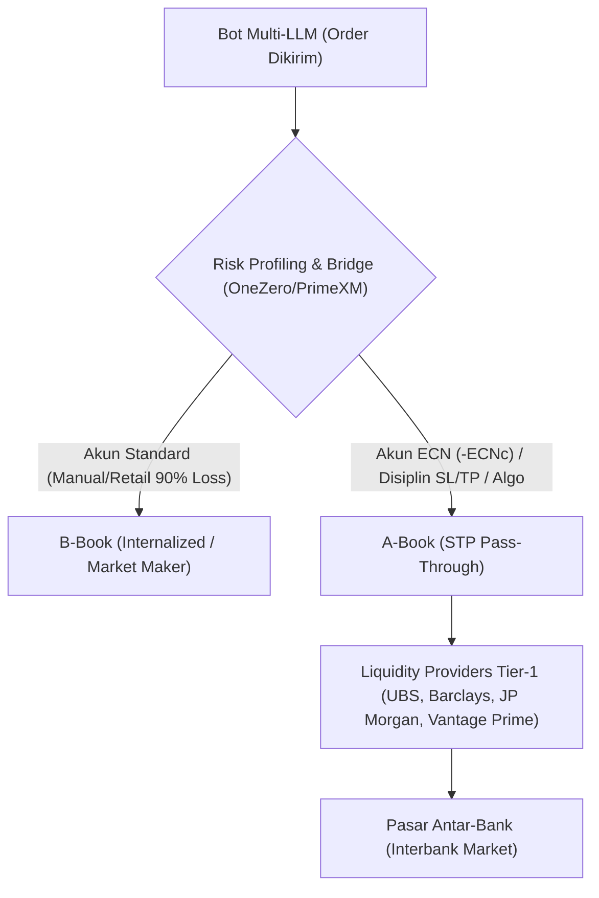

# 🏛️ Analisis Infrastruktur Broker, Regulasi, & Keamanan Dana (Algo Trading)

> **Panduan Strategis & Referensi Arsitektur Broker untuk Bot Trading Multi-LLM**  
> Terakhir Diperbarui: **24 Agustus 2026**

---

## 1. 🔍 Bedah Ekosistem VT Markets (`VTMarkets-Live 3`)

Sistem bot trading saat ini berjalan secara live di broker **VT Markets** (Login `27556325`, Server `VTMarkets-Live 3`). Berikut adalah analisis mendalam mengenai struktur legalitas, penempatan dana, dan mekanisme eksekusi teknisnya:

### A. Struktur Multi-Entitas Broker
VT Markets beroperasi di bawah payung grup keuangan global (ekosistem Vantage Global Prime) dengan pembagian entitas sebagai berikut:

| Entitas Hukum | Regulator & Lisensi | Peran & Yurisdiksi |
|---|---|---|
| **VT Markets Limited** | **FSC Mauritius** (No. GB23202269) | **Entitas Akun Klien Internasional/Asia (Termasuk Indonesia)**. Menangani kontrak trading, penyediaan leverage fleksibel (1:500), dan operasional akun live non-Eropa/non-Australia. |
| **VT Markets (Pty) Ltd** | **FSCA Afrika Selatan** (FSP No. 50865) | Bertindak sebagai perantara finansial resmi (*Intermediary*) di wilayah Afrika. |
| **VT Markets (Pty) Ltd (Dubai Branch)** | **CMA UAE** (No. 20200000299) | Kantor representasi promosi & pengenalan di Timur Tengah. |
| **VTMarkets Ltd (Cyprus)** | **Registrasi Siprus** (Reg No. HE436466) | **Payment Processing Hub**: Memproses gateway transfer deposit/withdrawal (Bank Lokal, QRIS, Kartu Kredit, USDT). |
| **Vantage / VT Group (Australia)** | **ASIC Australia** (Tier-1) | Entitas induk institusional untuk klien residen Australia. |

### B. Infrastruktur Server & Eksekusi (`VTMarkets-Live 3`)
* **Lokasi Server Fisik**: Mesin server MT5 `VTMarkets-Live 3` berlokasi di data center **Equinix LD4 (London)** dan **NY4 (New York)**.
* **Tipe Akun Bot (`-ECNc` / Raw ECN)**:
  * Akun dengan suffix `-ECNc` adalah akun **Raw ECN**.
  * Spread mentah dari Liquidity Provider (LP) diteruskan langsung ke bot tanpa markup buatan (Contoh riil: `GBPCHF`: 0.0 pt, `EURCHF`: 1.0 pt, `GBPUSD`: 2.0 pts).
  * Broker memperoleh pendapatan murni dari komisi transaksi per lot ($6 / $7 round-turn), bukan dari kekalahan (*loss*) trader.

---

## 2. ⚙️ Realitas Eksekusi: A-Book vs B-Book pada Algo Trading

Mayoritas broker retail global menggunakan model **Hybrid**:

### Mengapa Bot Kita Di-A-Book oleh Broker?
1. **Deteksi Algo Trading**: Sistem manajemen risiko broker otomatis mengenali pola order yang dikirim via API MetaTrader5 dengan frekuensi teratur dan SL/TP pasti.
2. **Eliminasi Market Risk**: Broker tidak mau menanggung risiko kerugian jika bot yang disiplin menghasilkan profit besar. Oleh karena itu, order dilempar ke Liquidity Provider eksternal (*A-Book STP*), dan broker mengambil profit pasti dari komisi tiket.

---

## 3. 🗺️ Roadmap Alokasi Broker Berdasarkan Skala Modal

Prioritas pemilihan broker berubah secara fundamental seiring bertambahnya kapital:

| Skala Modal | Prioritas Utama | Rekomendasi Broker | Alasan & Keunggulan |
|---|---|---|---|
| **Tier 1: Retail / Testing**   `$65 – $3.000`   *(Rp 1jt – Rp 50jt)* | Spread ultra-rendah, leverage fleksibel (1:500), kemudahan deposit/WD lokal. | **VT Markets (`-ECNc`)** **IC Markets Global** **Pepperstone** | Sangat aman untuk operasional bot harian. Spread 0–2 pts memaksimalkan edge sistem tanpa risiko modal tertahan. |
| **Tier 2: Institutional Growth**   `$10.000 – $50.000`   *(Rp 150jt – Rp 800jt)* | Likuiditas ECN institusional, eksekusi direct market, reputasi global teruji. | **IC Markets (ASIC/FCA)** **Pepperstone (ASIC/FCA)** **Swissquote Bank** | Broker ECN raksasa dunia dengan volume triliunan dollar. Server Equinix NY4/LD4 dengan slippage minimal. |
| **Tier 3: Institutional Ultra-Safety**   `$50.000 – $100.000+`   *(Rp 800jt – Rp 2 Miliar+)* | **Kepastian Hukum Mutlak**, Asuransi Perbankan Negara (*Statutory Guarantee*). | **Swissquote Bank (Swiss)** **Interactive Brokers (IBKR)** **Dukascopy Bank** | • **Swissquote**: Bank Swiss resmi (FINMA), asuransi dana *esisuisse* s/d **CHF 100.000**. • **IBKR**: Terdaftar NASDAQ (SEC/CFTC), proteksi SIPC s/d **$500.000**. • Rekening atas nama bank pribadi langsung. |
| **Tier 4: Legalitas Yurisdiksi Domestik**   `Rp 100jt – Rp 1 Miliar+` | Kepastian hukum penuh dalam yurisdiksi pengadilan Republik Indonesia. | **MIFX (Monex)** **Valbury Asia** **GKInvest** | 100% diawasi **Bappebti** / Kemendag RI. Dana tersimpan di **Kliring Berjangka Indonesia (KBI)** / ICDX. *(Trade-off: Spread lebih lebar & leverage maks 1:100)*. |

---

## 4. 🛡️ Checklist Keamanan Operasional Trading Live

1. **Kesesuaian Nama Rekening**: Selalu gunakan rekening bank / wallet crypto atas nama pribadi yang sama persis dengan akun broker (kebijakan anti-money laundering broker internasional).
2. **Diversifikasi Dana Bertahap**: Ketika profit bot terakumulasi melampaui $10.000, lakukan penarikan berkala (*regular withdrawal*) atau alokasikan portofolio ke broker bank Tier-1 (seperti Swissquote / IBKR).
3. **Proteksi Pre-Rollover & Spread Spike**: Tetap aktifkan fitur bot `Pre-Rollover Shield` (03:00–04:55 WIB) dan filter spread ATR untuk menghindari pelebaran spread rollover harian broker.
