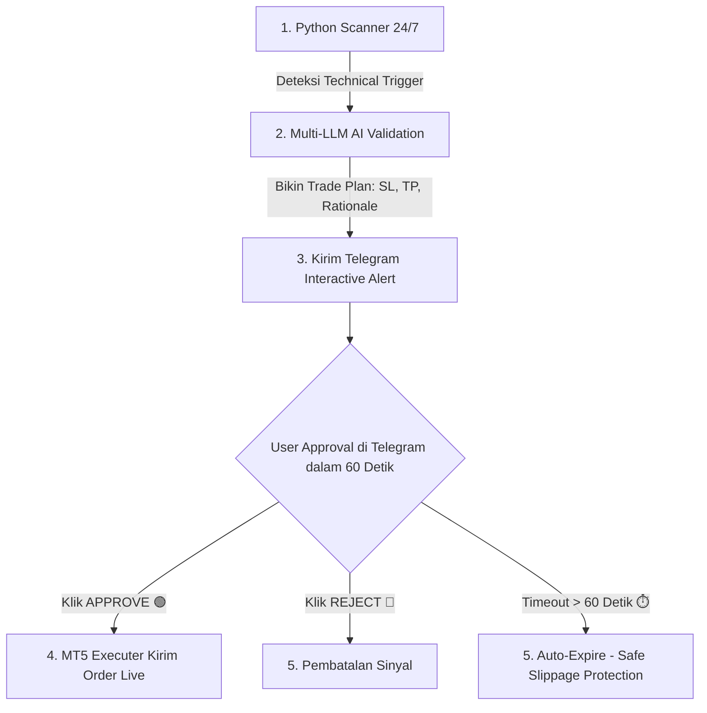

# 🏛️ BLUEPRINT: HYBRID QUANT-LLM & HUMAN-IN-THE-LOOP (HITL) TRADING BOT

## 📋 Executive Summary
Dokumen ini mendefinisikan arsitektur masa depan untuk bot trading MetaTrader 5 (**HanashiAI / TradingPartner**). Arsitektur ini menggabungkan **24/7 Deterministic Python Scanner**, **Multi-LLM AI Risk Auditor**, **Telegram Human-in-the-Loop (HITL) Approval**, dan **Adaptive Asset Engine** berbasis bukti backtest kuantitatif 3 tahun real MT5 data (VTMarkets).

---

## 🏗️ 1. Arsitektur Hybrid System (End-to-End Workflow)

---

## ⚡ 2. Komponen 1: Python 24/7 Scanner & Edge Engine (src/core/scanner.py)
Pemantauan harga tanpa henti di latar belakang (tanpa biaya LLM, 0ms delay) menggunakan kriteria statistik teruji:

1. **S9 Horn Bottoms / Horn Tops + Strong Close Filter** *(terverifikasi: GBPUSD-only, lihat section 3-A)*:
   - Pola reversal 2-lembah / 2-puncak sejajar dengan penutupan candle breakout kuat (Close di 20% area terujung candle).
   - **Exit rule wajib: TP structural (level resistance 2-hari, floor R:R 1.5) — BUKAN neckline + height** (R aktual ~0.22 = kalah).
   - **Hanya GBPUSD-ECNc** — XAU tidak signifikan, semua pair cross negatif (terverifikasi 20 Agustus).
2. **Dual-Window Trend-Aware Fibonacci (50-Bar & 100-Bar)**:
   - Uptrend Pullback & Downtrend Rebound di level Retracement 38.2%, 50.0%, 61.8%.
3. **Dynamic EMA Confluence (EMA 20, 50, 200)**:
   - Menilai EMA200 Macro Regime + EMA20 Retest Distance (dalam points).
4. **ADX Regime Expansion Filter (ADX 14)**:
   - ADX >= 25 (Trend expansion, trade with trend), ADX < 20 (Mean-reversion bounce).
5. **Key Level Retest (D1 PDH, PDL, Today Open, Round Numbers)**:
   - Rejection pada level harga psikologis & historis.

---

## 🧭 3. Komponen 2: Adaptive Asset Engine (src/core/risk_engine.py)
Berdasarkan hasil backtest 3 tahun data real VTMarkets (Mei 2022 – Agustus 2026), strategi manajemen risiko dan penentuan Target Profit (TP) disesuaikan secara dinamis dengan **Karakteristik Likuiditas Aset**:

### 🟢 A. High-Liquidity / Trending Assets (GBPUSD)
- **Karakteristik**: Volatilitas harian tinggi (800 - 5000 points), membentuk pergerakan tren panjang yang patuh pada level struktur.
- **Target Mode**: `htf_structural` — level resistance/support 2-hari (`rolling(50).max()` bar **H1**, ≈2 hari; bukan H4 sungguhan) dengan **floor R:R 1.5** — ATAU `rr_2.0` (Fixed 2.0:1 R:R). Keduanya terverifikasi. 
- **Hasil Backtest Real (3 tahun, R aktual, timeout dihitung, spread dipotong)**: **GBPUSD EV = +0.196 R** (CI95% low +0.034, **5/5 tahun positif**: 2022 +0.564, 2023 +0.072, 2024 +0.137, 2025 +0.166, 2026 +0.098). **XAUUSD TIDAK signifikan** (+0.023, CI_low −0.102, 3/5 tahun negatif) → **dihapus dari klaim edge**.
- **Position Protection**: **TIDAK pakai trailing/BEP** — backtest 20 Agustus membuktikan trailing 20 EMA (−0.045), Higher Low + 1.0 ATR buffer (+0.033, tidak signifikan), dan BEP 35–65% (+0.066 / +0.027) **semuanya memangkas edge fixed TP** (+0.196). Exit disiplin di level structural adalah sumber edge (avg win 1.78R vs avg loss 1.0R, hold ~1.7 hari).

### 🟡 B. Cross / Ranging Assets (CADCHF, AUDCAD, EURCHF)
- **Karakteristik**: Pergerakan horizontal (*range-bound*). Target HTF jauh terbukti berisiko tinggi (memantul 180 derajat sebelum menyentuh TP) — **terverifikasi: SEMUA 7 pair cross negatif di backtest S9** (20 Agustus).
- **Target Mode**: `fixed_range_tp` (keluar beberapa pips sebelum batas range seberang) atau **Eksklusi Signal S9 Breakout** (opsi yang terverifikasi benar).
- **R:R Minimum**: Toleransi 1.25 : 1 dengan penutupan posisi instant di batas range.

---

## 🧠 4. Komponen 3: Multi-LLM AI Analyst & Auditor (src/core/llm_client.py)
Menerima calon sinyal (*candidate trade*) dari Python Scanner untuk diaudit secara kualitatif:
- **Tugas LLM**: Memvalidasi konteks makro/berita, memastikan tidak ada perang/rilis data rintangan, menentukan presisi Stop Loss (SL) & Take Profit (TP), serta membuat 2-sentence rationale.
- **Time-Based Consensus** *(update 20 Agustus — sesuai produksi)*:
  - *00:00 – 18:59 WIB*: Dual AI Consensus (OpenAI gpt-5.2 window 15:00–19:30 / o3-mini default + Gemini 3.1 Flash Lite).
  - *19:00 – 22:00 WIB*: Triple AI Consensus (OpenAI + Gemini 3.1 Flash Lite + DeepSeek V4 Flash, fallback Claude Haiku).

---

## 📱 5. Komponen 4: Interactive Telegram HITL System (src/core/telegram_alerts.py)
Notifikasi interaktif yang dikirim ke HP Pengguna saat AI menyetujui candidate trade:

- **Format Pesan**: Simbol, Arah (BUY/SELL), Entry, SL, TP, Risk Amount ($), R:R, dan AI Rationale.
- **Inline Keyboard Buttons**:
  - [ 🟢 APPROVE & EXECUTE ] -> Mengirim order instant ke broker VTMarkets via MT5.
  - [ 🔴 REJECT ] -> Membatalkan usulan sinyal.
- **Timeout Protection**: Default 60 detik → sinyal otomatis **Expired** untuk mencegah *slippage*. **Catatan**: untuk sinyal swing S9 (hold 1–2 hari) pertimbangkan jendela lebih panjang (5–10 menit) agar user tidak ketinggalan sinyal.

---

## 🗺️ 6. Roadmap Implementasi Masa Depan
1. **Fase 1**: Membuat module src/core/scanner.py (Quantitative Edge Engine + S9 Horn + Strong Close — **GBPUSD-only, exit TP structural floor R:R 1.5**).
2. **Fase 2**: Implementasi Adaptive Asset Engine di src/core/risk_engine.py (Split target parameters antara Major vs Cross — **tanpa trailing/BEP, sudah terbukti memangkas edge**).
3. **Fase 3**: Membangun Telegram Webhook Callback & Inline Button Handler di telegram_alerts.py.
4. **Fase 4**: Refaktorisasi main.py ke alur Hybrid Scanner-LLM-Telegram.
