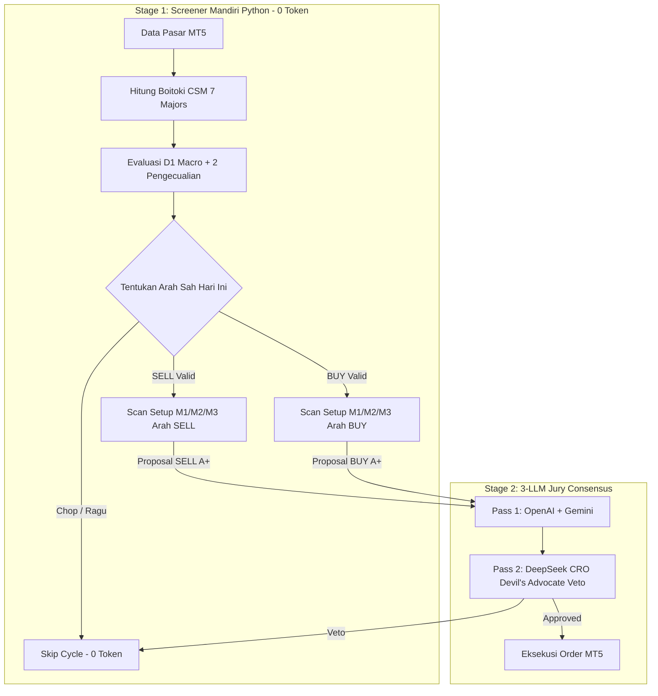

# Dokumen Spesifikasi Arsitektur: Intraday Market Cycle & Boitoki CSM Engine

> **Status**: APPROVED FOR BACKTEST & QUANTITATIVE VALIDATION  
> **Versi**: 1.0.0  
> **Tanggal**: 27 Agustus 2026  
> **Tujuan**: Menghilangkan bias *Macro Bias Trap* (membabi-buta BUY saat D1 Bullish), memadukan *Boitoki Currency Strength Matrix (CSM)*, dan menangkap dinamika siklus harian (*Power of 3 & Retracement to D1 Support*).

---

## 1. Latar Belakang & Masalah Pokok

### 1.1 Masalah "Macro Bias Trap"
Banyak sistem trading algoritmik mengalami kerugian beruntun (*consecutive losses*) pada pair Forex karena mengasumsikan bahwa:
$$\text{Tren D1 / H4 Bullish} \implies \text{Wajib Selalu Mengambil Posisi BUY}$$

**Realitas Pergerakan Harian**:
Candle harian (D1) yang berakhir *bullish* hampir selalu membentuk **ekor bawah (wick)** di awal sesi (Tokyo / awal London). Di fase ini, harga bergerak **TURUN (Retracement / Mean Reversion)** untuk menjemput area *Demand H1 / EMA20 D1* sebelum melanjutkan kenaikan. Jika bot membuka posisi BUY di fase ini, posisi akan terkena Stop Loss di dasar koreksi.

### 1.2 Masalah "Single-Pair Silo"
Saat menganalisis chart `GBPUSD` atau `GBPJPY`, bot tidak mengetahui bahwa di saat yang sama `GBPAUD`, `GBPCAD`, dan `GBPCHF` sedang mengalami *systemic liquidation* (arus keluar modal mata uang GBP secara global). Akibatnya, bot mengira harga sedang "diskon murah", padahal sedang terjadi kejatuhan mata uang.

---

## 2. Arsitektur Solusi Terpadu

Sistem dibagi menjadi 3 pilar:

```
+-------------------------------------------------------------------------------+
|                           1. MACRO ANCHOR (D1 / H4)                           |
|       Menentukan Level Pijakan Mayor: Support Breakout, Demand, EMA200       |
+---------------------------------------+---------------------------------------+
                                        |
                                        v
+-------------------------------------------------------------------------------+
|                    2. BOITOKI CURRENCY STRENGTH MATRIX (CSM)                  |
|    Sintesis 8 Mata Uang via 7 USD Majors: Delta(Base - Quote) [-100, +100]    |
+---------------------------------------+---------------------------------------+
                                        |
                                        v
+-------------------------------------------------------------------------------+
|                 3. INTRADAY PHASE & EXCEPTION ENGINE (H1 / M15)               |
|      Mendeteksi Fase Harian: Expansion vs Retracement to D1 Support           |
+-------------------------------------------------------------------------------+
```

---

## 3. Komponen 1: Boitoki Currency Strength Matrix (CSM)

### 3.1 Efisiensi Komputasi (7 USD Majors)
Sistem hanya perlu memuat 7 pair mayor USD:
1. `EURUSD`
2. `USDJPY`
3. `USDCHF`
4. `GBPUSD`
5. `AUDUSD`
6. `USDCAD`
7. `NZDUSD`

### 3.2 Rumus Logaritmik Sintesis 28 Pairs
Setiap pasangan dihitung perubahannya relatif terhadap $N$ bar lalu:
$$\text{Return}(Pair) = \ln\left(\frac{\text{Price}_t}{\text{Price}_0}\right) \times 10000$$

Cross pairs dihitung secara aljabar logaritmik instan:
* **Perkalian (e.g. EURJPY)**:
  $$\text{EURJPY} = \ln\left(\frac{\text{EURUSD}_t \times \text{USDJPY}_t}{\text{EURUSD}_0 \times \text{USDJPY}_0}\right) \times 10000$$
* **Pembagian (e.g. EURGBP)**:
  $$\text{EURGBP} = \ln\left(\frac{\text{EURUSD}_t / \text{GBPUSD}_t}{\text{EURUSD}_0 / \text{GBPUSD}_0}\right) \times 10000$$

### 3.3 Akumulasi 8 Mata Uang & Delta
Kekuatan masing-masing mata uang adalah rata-rata return terhadap 7 lawannya:
$$\text{Currency}(C) = \frac{1}{7} \sum_{k=1}^{7} \text{CrossReturn}(C, k)$$

$$\text{Currency Delta}(A/B) = \text{Currency}(A) - \text{Currency}(B)$$

* **Delta $> +20$**: Bullish Flow (Base kuat vs Quote lemah).
* **Delta $< -20$**: Bearish Flow (Base lemah vs Quote kuat).
* **Delta $[-20, +20]$**: Neutral / Chop (Kompresi).

---

## 4. Komponen 2: Intraday Phase & 2 Exception Rules

### 4.1 Aturan Default (Baseline)
* **D1 Bullish**: Mencari posisi **BUY** di zona *Discount H1 / M15* searah tren makro.
* **D1 Bearish**: Mencari posisi **SELL** di zona *Premium H1 / M15* searah tren makro.

---

### 4.2 Dua Pengecualian Kritis (Exception Rules)

#### Pengecualian 1: Currency Flow Shock (Outflow Crash)
* **Kondisi**: Tren D1 adalah Bullish, **TETAPI** $\text{Currency Delta}(A/B) < -20$ di timeframe H1/M15 (Mata uang dasar mengalami *dumping* serentak di semua pair).
* **Keputusan**:
  * **Hapus Bias Bullish D1**.
  * Ubah arah trade intraday hari ini menjadi **SELL ONLY** atau **NO TRADE**.
  * **DILARANG KERAS MEMBUKA BUY**.

#### Pengecualian 2: Post-Breakout Retracement (Mencari Pijakan Support D1)
* **Kondisi**:
  1. Harga baru saja melakukan breakout D1 dan berada di pucuk (*Overextended*: Jarak harga $> 1.5\times \text{ATR D1}$ di atas Support D1 / EMA20 D1).
  2. Struktur M15/H1 menunjukkan *Lower Highs / Lower Lows* (fase turun mencari pijakan).
* **Keputusan**:
  * **Fase Retracement Turun**: Dilarang BUY di pucuk.
  * **Arah Intraday**: Diizinkan mengambil posisi **SELL Intraday** menuju level Pijakan Support D1 dengan target terukur.
  * **Fase Rebound Pijakan**: Setelah harga menyentuh Support D1 dan terbentuk konfirmasi rejection (*CHoCH / Pinbar H1*), barulah posisi **BUY A+** dieksekusi dengan R:R maksimal.

---

## 5. Integrasi 2-Stage Quant Funnel



---

## 6. Rencana Verifikasi Backtest

Backtest kuantitatif akan menguji hipotesis ini pada dataset FBS (2022–2026) di 22 pair:
1. **Model A (Baseline)**: Blind Macro Trend Follower (D1 Bullish = Buy Only, D1 Bearish = Sell Only).
2. **Model B (Proposed)**: CSM + Intraday Phase Engine (D1 Macro + Boitoki CSM Delta + 2 Critical Exceptions).

**Metrik Keberhasilan**:
- Peningkatan Profit Factor ($\ge +20\%$).
- Penurunan False Buy pada pair GBP/EUR saat terjadi systemic outflow.
- Peningkatan Win Rate pada fase post-breakout pullback.
