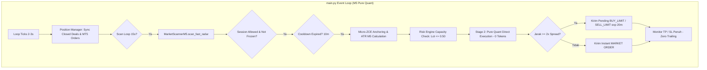

# Desain Teknis: Migrasi `main.py` ke Mode M5 Pure Quant Direct Execution (Live Cent)

- **Tanggal**: 2026-09-14
- **Status**: Validated by Grill-Me Interview
- **Target Eksekusi**: Akun Live Cent `VTMarkets-Live 3` (#27556325)
- **Timeframe Utama**: M5 (Fast-In Fast-Out Scalp)
- **Arsitektur Eksekusi**: Pure Quant Direct (< 100ms Latency, 0 Tokens, No-LLM)

---

## 1. Latar Belakang & Tujuan

Pengujian isolated di `main_demo.py` telah membuktikan efektivitas pemindaian berkecepatan tinggi di timeframe M5 menggunakan **Micro-ZCE (M5/M15/H1)** dan geometri **$1.25 \times \text{ATR}_{M5}$**. Pengguna menginginkan arsitektur ini diimplementasikan langsung ke `main.py` untuk beroperasi pada akun **Live Cent** (`VTMarkets-Live 3`) dengan aturan:
1. Fungsionalitas `main_demo.py` diarsipkan, dan `main.py` dibuat modular mendukung mode M5 native secara penuh.
2. Menggunakan anchoring TP/SL Micro-ZCE (Stasiun C1/F1) dan ATR M5 identik dengan formula demo.
3. Menghapus batasan kuota keranjang (`ENABLE_CBSS=false`) dan pembatasan internal hedge (`ENABLE_ANTI_INTERNAL_HEDGE=false`), serta membuka kapasitas total hingga 50 slot posisi.
4. Mengunci lot maksimal per posisi secara simetris pada `MAX_POSITION_LOT=0.50` Cent.
5. Mempertahankan aturan keras **Session Gating** (Tokyo, London, NY session allowed pairs), **Night Freeze**, dan **Dead Zone**.
6. Memangkas durasi cooldown rejection dan post-loss menjadi **10 menit (600 detik)**.
7. Menonaktifkan Trailing Stop dan Break-Even (`TRAILING_STOP_ENABLED=false`, `BREAK_EVEN_ENABLED=false`), membiarkan trade menyentuh target TP atau SL penuh (binary outcome).

---

## 2. Arsitektur Komponen & Alur Kerja

---

## 3. Rincian Penyelarasan 8 File Wajib (AGENTS.md Checklist)

### 3.1. `config.py` & `.env`
- `.env`:
  - `TIMEFRAME=M5`
  - `RADAR_SCAN_INTERVAL_SECONDS=15`
  - `ENABLE_LLM_JURY=false`
  - `MAX_OPEN_POSITIONS=50`
  - `MAX_ABSOLUTE_OPEN_POSITIONS=50`
  - `MAX_POSITION_LOT=0.50`
  - `ENABLE_CBSS=false`
  - `ENABLE_ANTI_INTERNAL_HEDGE=false`
  - `SCANNER_MECHANISM_REJECTION_COOLDOWN_SECONDS=600`
  - `POST_LOSS_COOLDOWN_SECONDS=600`
  - `SCANNER_SYMBOL_BREATHING_COOLDOWN_SECONDS=120`
  - `TRAILING_STOP_ENABLED=false`
  - `BREAK_EVEN_ENABLED=false`
  - `M5_PENDING_EXPIRATION_MINUTES=20`
  - `MT5_ACCOUNT_MODE=live`
- `config.py`:
  - Pastikan default fallback untuk variabel-variabel di atas terdefinisi secara aman.

### 3.2. `src/core/llm_client.py`
- Pastikan modul ini aman saat tidak dipanggil (zero import side-effects).
- Tetap sediakan socket data candle M5 (`format_micro_tape`) jika on-demand audit dipanggil via CLI/Telegram.

### 3.3. `src/core/cli_theme.py` & `main.py`
- `main.py`:
  - Deteksi `config.TIMEFRAME_STR == "M5"`:
    Secara modular memuat `MarketScannerM5` yang menginisialisasi `Micro-ZCE` (M5/M15/H1).
  - Inisialisasi awal `decisions = {}` sebelum blok `if not getattr(config, "ENABLE_LLM_JURY", True):` untuk mencegah `NameError`.
  - Pastikan parameter expiration pending limit order menggunakan `config.M5_PENDING_EXPIRATION_MINUTES` (20 menit).
- `cli_theme.py`:
  - Render banner CLI menampilkan status arsitektur:
    `Architecture: PURE QUANT RADAR M5 (15s Loop | Direct Execution | Cooldown 10m)`
  - Status line clock terminal mencerminkan deteksi candle 5 menit.

### 3.4. `src/core/telegram_bot.py` & `telegram_alerts.py`
- Selaraskan pesan alert order terpasang dan status `/status` agar mencerminkan mode M5 Pure Quant di akun Cent.

### 3.5. `src/analytics/macro_strategic_engine.py`
- Pertahankan singleton native sockets MSE 6-TF (`MN1/W1/D1/H4/H1/M30`) untuk directional permission bias M5 radar.

### 3.6. `src/core/risk_engine.py` & `position_manager.py`
- `risk_engine.py`:
  - Membaca kapasitas 50 slot posisi tanpa membatasi via CBSS jika dinonaktifkan.
  - Menjaga plafon per-posisi pada `MAX_POSITION_LOT=0.50`.
- `position_manager.py`:
  - Menghormati flag `TRAILING_STOP_ENABLED=false` dan `BREAK_EVEN_ENABLED=false` sehingga order M5 tidak digeser SL-nya, murni menyentuh TP ZCE atau SL ATR.
  - Tetap menjalankan `Pre-Rollover Shield` (03:50–04:15 WIB) untuk menutup order berbahaya jelang rollover harian.

### 3.7. `tests/test_*.py`
- Uji integrasi M5 scanner dan eksekusi Pure Quant:
  - `tests/test_market_scanner_m5.py`: Pastikan geometri SL/TP dan inisialisasi micro-ZCE valid.
  - Verifikasi seluruh unit test suite berjalan 100% PASS.

### 3.8. `docs/CHANGELOG_SEPTEMBER_2026.md` & `AGENTS.md`
- Catat pembaruan arsitektur M5 Pure Quant Live Cent secara detail.
- Arsipkan status `main_demo.py`.

---

## 4. Rencana Pengujian & Verifikasi

1. **Unit Test Verification**:
   - `pytest tests/test_market_scanner_m5.py -v`
   - `pytest tests/test_pattern_engine.py -v`
   - `pytest tests/test_macro.py -v`
2. **Koneksi Live & Boot Test**:
   - Jalankan `py -3 main.py` selama 1–2 siklus scan untuk memastikan:
     - Terhubung ke `VTMarkets-Live 3` (#27556325).
     - Micro-ZCE preheat 28 pair sukses dalam ~10 detik.
     - Radar loop 15 detik berjalan tanpa error / exception.
     - Shutdown bersih via Ctrl+C.
